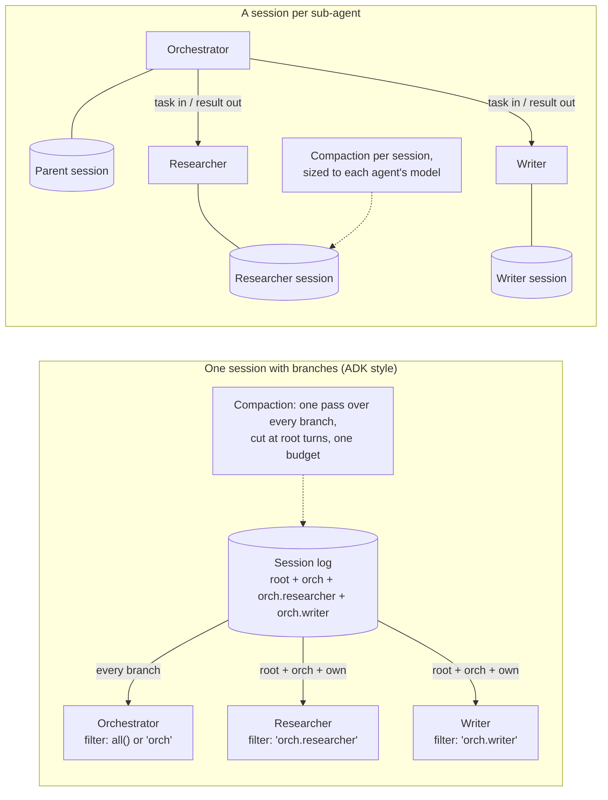
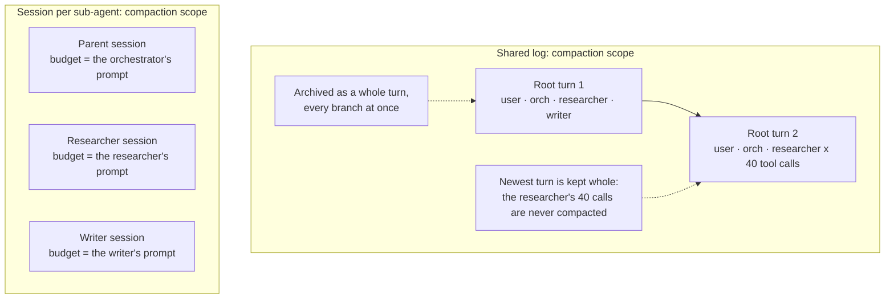

# Multi-agent history in spring-ai-session: branches or a session per sub-agent?

*Maintainer decision record. Status: proposed. Date: 2026-09-27.*

## 1. Summary

**Question.** spring-ai-session supports multi-agent conversations the way Google ADK
does: one session log, with each event tagged by a dot-separated `branch` and each agent
reading its own branch plus its ancestors'. Should we keep this, harden it, cut it back,
move it to a separate module, or remove it and leave multi-agent orchestration to user
code and other libraries?

**Findings.**

- **Two different things get called "multi-agent".**
  - In a *handoff*, several agents take turns in one conversation. That works best with
    one shared log, and it needs no branch filtering, because every agent sees
    everything.
  - In a *delegation*, the parent hands a sub-agent a task and gets a result back. That
    works best with a separate history per sub-agent, where only the task goes in and only
    the result comes out.
  - Branches sit between the two and don't fully serve either.
- **Branches don't fit compaction.**
  - Compaction's unit is the root turn.
  - Budgets measure all branches together.
  - A sub-agent that grows inside one turn is never compacted.
  - Recursive summaries leak sub-agent work to sibling agents.
  - When the log has no root-level user message, `TokenCountCompactionStrategy` archives
    the entire active window. That's a data-loss bug in the current code (§6).
- **The industry has mostly moved to isolated sub-agent histories.**
  - Claude Code / Agent SDK subagents, Microsoft Agent Framework (MAF) agent-as-tool,
    ADK's own `AgentTool` and OpenAI `as_tool` all give the sub-agent a separate history.
  - Anthropic, Google's ADK team and Cognition (2026) all recommend minimal, isolated
    sub-agent context.
  - Among the frameworks compared here, only ADK keeps a shared, branch-filtered log, and
    its compaction has the same leak ours does.
- **Session per sub-agent already works today** with no new API (§7). It gets correct
  compaction, isolation and resume for free. The sibling project `spring-ai-agent-utils`
  needs exactly this: its `TaskTool` promises "resume with full previous context", but
  nothing backs that promise (§9).

**Recommendation.**
1. Make **session per sub-agent** the documented multi-agent model.
2. **Remove the branch semantics** (option D, §8), in two steps:
   - **0.9.0:** fix the data-loss bug, deprecate the branch APIs, document the new
     pattern.
   - **0.10.0:** remove the semantics from compaction, system-message handling, the
     advisor and the tools.
3. Offer a session-backed `SubagentExecutor` to `spring-ai-agent-utils`.
4. If users show they need ADK parity, fall back to option B (keep `branch` as a plain
   tag). Don't keep hardening the current design (option A).

---

## 2. Branch support today

**What it does:**

- **Model.** `SessionEvent.branch` is a dot-separated path such as `orch.researcher`. A
  `null` branch marks a root event.
- **Reads.** `EventFilter.forBranch(b)` shows root events, `b`'s ancestors and `b`
  itself. It hides siblings and children.
  - A filter with no branch (`EventFilter.all()`, the advisor's default) sees every
    branch.
  - Visibility therefore flows down but not up (`EventFilter.java:308`).
- **Advisor.** Since `d5b437d`, `SessionMemoryAdvisor` both reads and writes on the
  branch of its filter (`SessionMemoryAdvisor.java:247`, `:304`, `:330`).
- **Compaction.**
  - Turns start only at root `USER` events (`CompactionRequest.java:55`,
    `CompactionUtils.snapToTurnStart`), so events on a branch are archived or kept
    together with their enclosing root turn.
  - The event-count strategies count only root events (`SlidingWindowCompactionStrategy.java:100`).
  - The token strategies count every non-system event.
- **System messages.** The latest stored system message on each branch is kept and never
  summarized. Only the root one counts toward the token budget
  (`CompactionUtils.budgetedEvents`).
- **Tools.** `SessionEventTools.builder().branch(...)` limits `conversation_search` to what
  that branch can see.
- **JDBC.**
  - There's a `branch VARCHAR(500)` column.
  - The branch check is a `LIKE` prefix match with escaping
    (`JdbcSessionRepositoryDialect.java:115`). Custom dialects must implement it.

**Footprint.** Branch handling touches:
- 14 main source files: the event, the filter, the service, the advisor, `CompactionUtils`,
  `CompactionRequest`, the four strategies, `SessionEventTools`, the JDBC repository and
  two dialects;
- the three schema scripts;
- dedicated test classes (`EventFilterBranchTests`, branch cases in every strategy test,
  the advisor IT);
- one reference page, `multi-agent.md`, and branch sections on five other pages.

Most of the recent bug fixes and design reviews (system-message pinning per branch, the
root-only budget, the advisor's branch scoping, the per-branch summary question) exist
only because of branches.

---

## 3. Two delegation patterns

| | **Handoff / transfer** | **Delegation / agent-as-tool** |
|---|---|---|
| Shape | Agents take turns talking to the user in one conversation | A parent gives a sub-agent a task and gets a result back |
| What the agent needs to see | The whole conversation | Its task, plus its own earlier work |
| Natural history model | One shared log | A separate history per sub-agent |
| Need for branch filtering | None (everyone sees everything) | None (separate logs already isolate) |
| Examples | OpenAI Agents SDK handoffs, LangGraph swarm, AutoGen teams, ADK agent transfer | Claude Code subagents, MAF `AsAIFunction`, ADK `AgentTool`, OpenAI `as_tool` |

The branch model covers a third, narrower shape: a hierarchy of agents in which each one
has to see the full conversation of all its ancestors but none of its siblings'.



---

## 4. How other frameworks do it

Checked against sources in September 2026; the URLs are in the appendix. "Separate"
means a separate history per sub-agent.

| Framework | Sub-agent history | What goes back to the parent | Where it is stored, keyed by | Compaction scope | Inspect / resume sub-agent |
|---|---|---|---|---|---|
| **Google ADK**: branch / transfer | Shared log, filtered by `branch` (Python `_contents.py`, Java `Contents.java`) | Everything, in the shared log | One session | Whole session, ignores branches. Summaries carry no branch, so every agent sees them | Yes (one log) |
| **Google ADK**: `AgentTool` | Separate: a new in-memory session on every call | Text of the last event; `state_delta` merged back | Thrown away | Not applicable | No |
| **LangGraph** | Shared if the subgraph uses the parent's state keys; separate if it has its own schema | Shared keys, or whatever the wrapper maps back | Parent `thread_id`; subgraphs under `checkpoint_ns` (`node:<uuid>`, nested levels joined by `\|`) | Per graph, wherever you place the summarization node | `get_state(..., subgraphs=True)`; accumulates across runs with per-thread persistence |
| **Microsoft Agent Framework** | Separate `AgentSession` per agent; .NET `AsAIFunction` creates a new session on every call unless you pass one | Only the tool result | Per session, through a history provider | Per agent (`CompactionProvider` / `IChatReducer`) | Only if you supply and keep the session yourself |
| **AutoGen AgentChat** | Team: one shared thread; `SocietyOfMindAgent`: the inner team is separate | Society of mind: one synthesized answer, then the inner team is reset | Team state (`save_state`) | Per agent `model_context` (buffered or token-limited) | Inner history is wiped |
| **Claude Code / Agent SDK** | Separate context window per subagent | Only the final message, plus an `agentId` | Separate transcript per subagent\* | Per subagent; the main conversation's compaction doesn't touch it\* | Yes: resume by `agentId` |
| **OpenAI Agents SDK** | Handoff: shared history (with `input_filter` / `nest_handoff_history`); `as_tool`: separate | Handoff: full history; `as_tool`: final output only | A `Session` per `session_id`; a nested run is persisted only if you pass it a session | Per session | Only with a session |
| **CrewAI** | Crew memory is shared unless an agent has its own; scoped views are available | Not applicable (long-term vector memory, not a message log) | LanceDB | Not checked | Not applicable |
| **spring-ai-agent-utils** `TaskTool` | Separate: a fresh `ChatClient` per task, **no memory** | Only the final message | Nowhere | Not applicable | **Promised, not implemented** (see §9) |

\* The transcript path and independent auto-compaction come from secondary sources (Claude
Code GitHub issues). Resume by agent ID is in the official docs.

**Pattern.** Every framework that offers delegation gives the sub-agent a separate
history. The shared log is used for handoffs. ADK is the only one that combines a shared
log with a per-agent visibility filter, and that's the part we copied, including the fact
that compaction ignores branches.

---

## 5. What published guidance says

- **Anthropic, "How we built our multi-agent research system".**
  - Subagents run in parallel, each with its own context window, and condense their
    findings for the lead agent.
  - The multi-agent setup beat a single agent by 90.2% on an internal research eval.
  - It used about 15× the tokens of a chat, against about 4× for a single agent.
  - Token usage alone explained 80% of the variance in performance.
  - Subagents store their work outside and pass references back, to avoid a "game of
    telephone".
- **Anthropic, "Effective context engineering for AI agents".**
  - Context is a finite "attention budget", and recall gets worse as tokens grow
    ("context rot").
  - Subagents return "a condensed, distilled summary of its work (often 1,000–2,000
    tokens)".
  - Use compaction for long conversations, structured notes for iterative work, and
    multi-agent for parallel exploration.
- **Google ADK team, "Architecting efficient context-aware multi-agent framework".**
  - "Every model call and sub-agent sees the minimum context required."
  - The session is the durable ground truth, while the working context is a compiled
    view rebuilt for every call.
  - For multi-agent, they offer agents-as-tools (minimal history) and agent transfer
    (history controlled by `include_contents`).
- **Cognition (Walden Yan), "Don't Build Multi-Agents" (2025).**
  - "Share full agent traces", because "actions carry implicit decisions": parallel
    agents that can't see each other produce parts that don't fit together.
  - The recommendation is a single-threaded writer.
  - *This is an argument against parallel writers, not for filtered shared logs.*
    Siblings under branches can't see each other either.
- **Cognition, "Multi-Agents: What's Actually Working" (2026).**
  - "Writes stay single-threaded and the additional agents contribute intelligence rather
    than actions."
  - A reviewer that gets only the diff, with no task history, catches more bugs; shared
    context degrades review because of context rot.
- **LangChain, "Context engineering for agents".** Isolation is one of four strategies:
  write, select, compress, isolate. Multi-agent setups and sandboxes are both forms of
  isolation.
- **Manus.**
  - Compression must be "restorable": keep references (paths, URLs), not content.
  - Keep context append-only and deterministic, so the KV-cache prefix stays stable (a
    10× cost difference between cached and uncached input).
- **OpenAI, "A practical guide to building agents".**
  - Get as far as possible with one agent first.
  - With handoffs, the new agent receives the latest conversation state.

**Consensus.** Keep a durable log as the record of truth, give each agent a working
context scoped to its task, and let only results or references cross between agents. A
separate session per sub-agent maps onto this directly. Branches share too much with
sub-agents (all ancestor history) and too little between siblings.

---

## 6. Evaluation of branches in spring-ai-session

### Strengths
- **One atomic, auditable log** for the whole multi-agent run, ordered by `seq`.
- **ADK parity:** the same `branch` semantics, which makes porting ADK designs easier.
- **One compaction** configuration for the whole conversation.
- **Recall across agents:** `conversation_search` without a branch finds every agent's
  work.

### Weaknesses

1. **Compaction measures the wrong thing.** The budget covers the union of all branches,
   but each agent sends only its own view.
   - A top-level agent on its own branch is charged for sibling chatter it never sends,
     so its conversation is archived too early.
   - The event-count strategies ignore branch events entirely
     (`SlidingWindowCompactionStrategy.java:100`), so a busy sub-agent never triggers
     compaction.
2. **Growth inside a turn is never compacted.** The newest root turn is always kept whole
   (`CompactionUtils.retainLastTurn`). A sub-agent that runs a long tool loop, or is
   delegated to many times within one user turn, stays unbounded.
3. **Summaries leak between branches.**
   - `RecursiveSummarizationCompactionStrategy` summarizes every archived event, other
     branches included.
   - The summary events it writes carry no branch (`RecursiveSummarizationCompactionStrategy.java:245`),
     so every agent sees them.
   - After compaction, the writer can read a summary of the researcher's internal work.
   - ADK behaves the same way.
4. **Data-loss bug.** When the active window has no root `USER` event:
   - `snapToTurnStart` returns `real.size()`;
   - `retainLastTurn` has no root turn to fall back to, so it also returns `real.size()`
     (`CompactionUtils.java:231`);
   - `TokenCountCompactionStrategy` then archives every real event
     (`TokenCountCompactionStrategy.java:126`, `:130`).

   `d5b437d` makes this easy to reach: a top-level agent whose advisor is set to a branch
   now writes the user's messages on that branch, not at the root. The other strategies
   do nothing in this case instead: SlidingWindow and Recursive find no root events, and
   TurnWindow treats the whole log as a kept preamble.
5. **Sub-agents get too much context.** A sub-agent inherits the full root and ancestor
   history. That's the opposite of the "minimum context" advice (§5), and it costs tokens
   on every sub-agent call.
6. **Contention between parallel sub-agents.**
   - Every append increments the session's `event_version` (`JdbcSessionRepository.java:141`).
   - Compaction's compare-and-set fails whenever any agent appends between the read and
     the write (`DefaultSessionService.java:149`, `:165`).
   - With several sub-agents writing to one session, compaction is skipped more often.
7. **Maintenance cost.** Every new feature has to answer the question "what about
   branches?", and the answers keep adding special cases:
   - system messages kept per branch;
   - the root-only budget;
   - the advisor's branch scoping;
   - the `LIKE` escaping;
   - the docs about which branch sees what.

   This matters for a module whose main job is conversation memory.



---

## 7. Session per sub-agent (works today)

Each sub-agent gets its own session. The parent passes a task in and gets only the result
back, as a tool result. Compaction, recall and resume then apply per sub-agent, with no
branch logic at all.

```java
public class ResearcherTool {

	// Metadata convention linking a sub-agent session to its parent (no library API)
	public static final String PARENT_SESSION_ID = "parentSessionId";

	public static final String AGENT = "agent";

	private final SessionService sessionService;

	private final ChatClient researcher;

	public ResearcherTool(SessionService sessionService, ChatClient.Builder chatClientBuilder) {
		this.sessionService = sessionService;
		// The sub-agent has its own memory advisor, with compaction sized for its own model
		this.researcher = chatClientBuilder.defaultSystem("You are a researcher. Cite every source.")
			.defaultAdvisors(SessionMemoryAdvisor.builder(sessionService)
				.compactionTrigger(new TurnCountTrigger(10))
				.compactionStrategy(SlidingWindowCompactionStrategy.builder().maxEvents(20).build())
				.build())
			.build();
	}

	@Tool(description = "Delegate a research task to the researcher agent and return its findings")
	public String research(@ToolParam(description = "The research task, with all needed context") String task,
			ToolContext toolContext) {

		String parentId = (String) toolContext.getContext().get(SessionMemoryAdvisor.SESSION_ID_CONTEXT_KEY);

		// Stable id: the researcher remembers earlier tasks of this conversation.
		// Use parentId + ":researcher:" + UUID.randomUUID() for a fresh context per task.
		String childId = parentId + ":researcher";

		if (this.sessionService.findById(childId) == null) {
			Session parent = this.sessionService.findById(parentId);
			try {
				this.sessionService.create(CreateSessionRequest.builder()
					.id(childId)
					.userId(parent.userId())
					.metadata(PARENT_SESSION_ID, parentId)
					.metadata(AGENT, "researcher")
					.build());
			}
			catch (IllegalStateException alreadyCreated) {
				// a concurrent delegation created it first
			}
		}

		// Only the task goes in and only the final answer comes back to the orchestrator
		return this.researcher.prompt()
			.user(task)
			.advisors(a -> a.param(SessionMemoryAdvisor.SESSION_ID_CONTEXT_KEY, childId))
			.call()
			.content();
	}

}
```

The orchestrator is an ordinary `ChatClient` call. It passes the session id to its
advisor and, through the tool context, to the tool:

```java
orchestrator.prompt()
	.user(question)
	.tools(researcherTool)
	.toolContext(Map.of(SessionMemoryAdvisor.SESSION_ID_CONTEXT_KEY, sessionId))
	.advisors(a -> a.param(SessionMemoryAdvisor.SESSION_ID_CONTEXT_KEY, sessionId))
	.call()
	.content();
```

Finding a conversation's sub-agent sessions:

```java
sessionService.findByUserId(userId)
	.stream()
	.filter(s -> parentId.equals(s.metadata().get(ResearcherTool.PARENT_SESSION_ID)))
	.toList();
```

*All three snippets compile against the current build (checked in a scratch project).*

**What you get:**
- the sub-agent's context is only its task plus its own history;
- compaction is sized to each agent's model, with no budget measured across agents, no
  leaks, and no root-turn dependency;
- a separate audit trail per sub-agent;
- resume by session id;
- no compare-and-set contention between agents.

**Gaps, all small:**
- **Parent link.** It exists only as a metadata convention. Finding a parent's children
  means scanning `findByUserId`.
- **Lifecycle.** Child sessions aren't deleted with the parent. Give them the parent's
  TTL, or delete them explicitly.
- **Recall.** `cross_session_search` covers every session of the user, sub-agent sessions
  included. That's usually useful, but you can't turn it off.
- **Timeline.** There's no single merged timeline of the whole run. You would merge the
  sessions by timestamp.

---

## 8. Options

### A. Keep and harden
- **Changes:**
  - fix the data-loss bug;
  - write summaries per branch (one LLM call per branch with archived events), which
    removes the leak;
  - document the budget and trigger limits;
  - maybe add token budgets scoped to one agent's view;
  - maybe add turns per branch, where a branched `USER` event starts a sub-turn.
- **API and schema:** additive.
- **Effort:** high; the per-branch summary alone touches the recursive strategy,
  `CompactionUtils`' handling of synthetic events, and the tests.
- **Risk:** keeps paying the maintenance cost in weakness 7 for a narrow use case.
  Weaknesses 2, 5 and 6 are part of the design and stay.
- **Who benefits:** users who want ADK's hierarchical visibility specifically.

### B. Opaque tag only
- **Changes:**
  - keep `SessionEvent.branch` as a free-form label, plus the `forBranch` read filter
    (or a general metadata filter);
  - remove branch semantics from compaction (turn = any `USER`), system messages (one
    latest overall) and the advisor (it neither writes nor selects by branch).
- **API and schema:** behavioral change; the column stays.
- **Effort:** medium.
- **Risk:** half-semantics. A user who mixes tagged `USER` events into one session gets
  turn cuts in the middle of a delegation. The label duplicates what `metadata` already
  offers.
- **Who benefits:** users who only need "which agent wrote this".

### C. Extension module (`spring-ai-session-multiagent`)
- **Changes:**
  - move branch filtering, branch-aware compaction and system-message selection into a
    separate module;
  - core would need new extension points for this:
    - a pluggable turn-boundary predicate;
    - a budget-view function in every strategy;
    - an event-visibility hook in the advisor;
    - a branch predicate in `SessionRepository` / the dialects, for SQL pushdown.
- **API and schema:** new service-provider interfaces in core; the column moves or stays.
- **Effort:** highest. The extension points are more complex than the feature itself.
- **Risk:** a second module to maintain and release for a small audience.
- **Who benefits:** ADK-parity users, while core gets simpler.

### D. Remove (recommended)
- **Changes:**
  - remove `branch` from `SessionEvent`, `EventFilter`, `SessionEventTools` and the
    advisor;
  - compaction treats every `USER` event as a turn start;
  - keep exactly one latest system message;
  - the JDBC column is left nullable and unused, or dropped with a migration note;
  - document session per sub-agent (§7), with `metadata` for agent labels.
- **API and schema:** breaking, which is allowed before 1.0. Roll it out in two steps:
  deprecate in 0.9.0, remove in 0.10.0.
- **Effort:** low to medium, and mostly deletion. About 14 main files get simpler, and the
  branch tests and docs sections go away.
- **Risk:** users of ADK-style hierarchical visibility lose it. The mitigation is §7 and
  §9, and option B as a fallback.
- **Who benefits:** everyone else: simpler compaction, simpler docs, and fewer "what about
  branches?" special cases.

| | A. Harden | B. Tag only | C. Module | D. Remove |
|---|---|---|---|---|
| Fixes the compaction mismatch | Partly | Yes (no semantics) | In the module | Yes |
| Leak between branches | Fixed | Gone | In the module | Gone |
| Core complexity | Higher | Lower | Lower, but new extension points | Lowest |
| Breaking change | No | Behavioral | Package move | Yes (deprecate first) |
| Effort | High | Medium | Highest | Low–medium |
| ADK parity | Yes | Partial | Yes | No |

---

## 9. Leaving multi-agent to user code and other libraries

**Split of responsibilities:**
- **spring-ai-session keeps:** storing conversations, compaction, recall, and idempotent,
  concurrency-safe appends. It stays a *memory* library.
- **Moves to orchestration code:** which agents exist, who delegates to whom, what context
  a sub-agent receives, parent/child links, and lifecycle.

That code can be the application itself (§7), `spring-ai-agent-utils`, or ADK/A2A
bridges.

**`spring-ai-agent-utils` fits this directly.**
- **The gap.** Its `TaskTool` tells the model that sub-agents "can be resumed using the
  `resume` parameter … with its full previous context preserved" and "will return a
  single message back to you along with its agent ID" (`TaskTool.java:72`–`73`). But:
  - `ClaudeSubagentExecutor.execute` builds a fresh `ChatClient` for every task;
  - it ignores `TaskCall.resume()`;
  - it returns no agent ID (`ClaudeSubagentExecutor.java:73`–`97`).
- **The fix.** A session-backed executor makes the promise real, and the agent ID becomes
  the session ID:

```java
public class SessionBackedSubagentExecutor implements SubagentExecutor {

	private final SubagentExecutor delegateKind; // the kind this executor wraps, e.g. CLAUDE

	private final SessionService sessionService;

	private final ChatClient chatClient; // built with a SessionMemoryAdvisor (and compaction)

	private final String userId;

	// constructor omitted

	@Override
	public String getKind() {
		return this.delegateKind.getKind();
	}

	@Override
	public String execute(TaskCall taskCall, SubagentDefinition subagent) {
		boolean resume = StringUtils.hasText(taskCall.resume())
				&& this.sessionService.findById(taskCall.resume()) != null;
		String agentId = resume ? taskCall.resume() : subagent.getName() + "-" + UUID.randomUUID();

		if (!resume) {
			this.sessionService.create(CreateSessionRequest.builder()
				.id(agentId)
				.userId(this.userId)
				.metadata("agent", subagent.getName())
				.build());
		}

		String result = this.chatClient.prompt()
			.user(taskCall.prompt())
			.advisors(a -> a.param(SessionMemoryAdvisor.SESSION_ID_CONTEXT_KEY, agentId))
			.call()
			.content();

		// TaskTool's description promises the agent id back, for a later resume
		return result + "\n\nagentId: " + agentId;
	}

}
```

*This sketch compiles against `spring-ai-agent-utils-common` 0.12.0-SNAPSHOT and the
current spring-ai-session build.*

**Limits of the sketch.** A real implementation would:
- build the `ChatClient` per definition, as `ClaudeSubagentExecutor` does (system prompt,
  tools, skills);
- take the user and the parent session from the `TaskTool`'s tool context. `TaskCall`
  doesn't carry them today, so `TaskTool` would need to pass a `ToolContext`.

The dependency then runs one way: agent-utils uses spring-ai-session as its memory, and
spring-ai-session knows nothing about agents.

**Users who really need ADK-style visibility** can still build it in their own code:
store an agent label in `SessionEvent.metadata` and filter the fetched events in a custom
advisor. A general *metadata* predicate on `EventFilter` would make that efficient. It's
a smaller and more broadly useful extension point than branches, and a possible
follow-up.

---

## 10. Recommendation and migration path

1. **0.9.0 (still open):**
   - **Fix the data-loss bug:** when the active window has no root `USER` event,
     `retainLastTurn` returns `0` (archive nothing). Add regression tests for every
     strategy.
   - **Document session per sub-agent** as the recommended multi-agent model. Rewrite
     `multi-agent.md` around §7, and keep a short "Branches (deprecated)" section that
     lists the limits in §6.
   - **Deprecate** `SessionEvent.Builder.branch`, `SessionEvent.getBranch`,
     `EventFilter.forBranch` / `Builder.branch` and `SessionEventTools.Builder.branch`,
     with Javadoc pointing to the new pattern.
   - **Keep `d5b437d`:** it makes the deprecated feature consistent (reads and writes on
     the same branch), and the migration note already covers it.
2. **Contribute to `spring-ai-agent-utils`:** a session-backed `SubagentExecutor` (§9),
   so that `resume` works.
3. **0.10.0: remove the branch semantics** (option D):
   - compaction treats every `USER` event as a turn start;
   - one latest system message;
   - no branch in the advisor, the filter or the tools;
   - drop the `LIKE` branch fragment from the dialect contract;
   - leave the JDBC column nullable and unused, and drop it in a later release, with a
     migration note.
4. **Fallback:** if users ask for ADK parity during the deprecation period, choose option
   B (tag plus read filter), or the metadata-predicate extension point in §9. Don't go
   back to option A.

**Decisions for the maintainers:**
- deprecate in 0.9.0, or remove outright before 0.9.0 ships;
- drop the JDBC column, or leave it in place;
- whether to offer the metadata predicate on `EventFilter`.

---

## Appendix: sources

**Frameworks**
- Google ADK Python, branch filtering: https://github.com/google/adk-python/blob/main/src/google/adk/flows/llm_flows/context/_contents.py
- Google ADK Python, compaction: https://github.com/google/adk-python/blob/main/src/google/adk/apps/compaction.py and https://github.com/google/adk-python/blob/main/src/google/adk/flows/llm_flows/context/_compaction.py
- Google ADK Python, summarizer: https://github.com/google/adk-python/blob/main/src/google/adk/apps/llm_event_summarizer.py
- Google ADK Python, `AgentTool`: https://github.com/google/adk-python/blob/main/src/google/adk/tools/agent_tool.py
- Google ADK Java, contents: https://github.com/google/adk-java/blob/main/core/src/main/java/com/google/adk/flows/llmflows/Contents.java
- Google ADK Java, compaction: https://github.com/google/adk-java/blob/main/core/src/main/java/com/google/adk/flows/llmflows/Compaction.java
- Google ADK Java, `AgentTool`: https://github.com/google/adk-java/blob/main/core/src/main/java/com/google/adk/tools/AgentTool.java
- Google ADK Java, `Event.branch`: https://github.com/google/adk-java/blob/main/core/src/main/java/com/google/adk/events/Event.java
- LangGraph subgraphs: https://docs.langchain.com/oss/python/langgraph/use-subgraphs and the namespace constants at https://github.com/langchain-ai/langgraph/blob/main/libs/langgraph/langgraph/_internal/_constants.py
- LangGraph supervisor and swarm: https://github.com/langchain-ai/langgraph-supervisor-py and https://github.com/langchain-ai/langgraph-swarm-py
- langmem summarization: https://langchain-ai.github.io/langmem/reference/short_term/
- Microsoft Agent Framework sessions: https://learn.microsoft.com/en-us/agent-framework/agents/multi-turn-conversation
- Microsoft Agent Framework compaction: https://learn.microsoft.com/en-us/agent-framework/agents/conversations/compaction
- Microsoft Agent Framework `AsAIFunction`: https://learn.microsoft.com/en-us/dotnet/api/microsoft.agents.ai.aiagentextensions.asaifunction
- Microsoft Agent Framework Python `as_tool`: https://github.com/microsoft/agent-framework/blob/main/python/packages/core/agent_framework/_agents.py
- AutoGen teams: https://microsoft.github.io/autogen/stable/user-guide/agentchat-user-guide/tutorial/teams.html
- AutoGen agents: https://microsoft.github.io/autogen/stable/reference/python/autogen_agentchat.agents.html
- Claude Code subagents: https://code.claude.com/docs/en/sub-agents and https://code.claude.com/docs/en/agent-sdk/subagents
- Claude Code, secondary sources for transcripts and compaction: https://github.com/anthropics/claude-code/issues/16944 and https://github.com/anthropics/claude-code/issues/96619
- OpenAI Agents SDK: https://openai.github.io/openai-agents-python/handoffs/, https://openai.github.io/openai-agents-python/tools/, https://openai.github.io/openai-agents-python/sessions/ and https://openai.github.io/openai-agents-python/ref/agent/
- CrewAI memory: https://docs.crewai.com/en/concepts/memory

**Guidance**
- Anthropic, How we built our multi-agent research system (2025-06-13): https://www.anthropic.com/engineering/multi-agent-research-system
- Anthropic, Effective context engineering for AI agents (2025-09-29): https://www.anthropic.com/engineering/effective-context-engineering-for-ai-agents
- Cognition, Don't Build Multi-Agents (2025-06-12): https://cognition.com/blog/dont-build-multi-agents
- Cognition, Multi-Agents: What's Actually Working (2026-04-22): https://cognition.com/blog/multi-agents-working
- LangChain, Context engineering for agents (2025-07-02): https://www.langchain.com/blog/context-engineering-for-agents
- LangChain, How and when to build multi-agent systems (2025-06-16): https://www.langchain.com/blog/how-and-when-to-build-multi-agent-systems
- Google, Architecting efficient context-aware multi-agent framework for production (2025-12-04): https://developers.googleblog.com/architecting-efficient-context-aware-multi-agent-framework-for-production/
- Manus, Context Engineering for AI Agents: Lessons from Building Manus (2025-07-18): https://manus.im/blog/Context-Engineering-for-AI-Agents-Lessons-from-Building-Manus
- OpenAI, A practical guide to building agents: https://cdn.openai.com/business-guides-and-resources/a-practical-guide-to-building-agents.pdf

**Code referenced** (spring-ai-session at `d5b437d`; spring-ai-agent-utils at 0.12.0-SNAPSHOT)
- `spring-ai-session/src/main/java/org/springframework/ai/session/EventFilter.java`
- `…/advisor/SessionMemoryAdvisor.java`
- `…/compaction/CompactionUtils.java`
- `…/compaction/CompactionRequest.java`
- `…/compaction/TokenCountCompactionStrategy.java`
- `…/compaction/SlidingWindowCompactionStrategy.java`
- `…/compaction/RecursiveSummarizationCompactionStrategy.java`
- `…/DefaultSessionService.java`
- `spring-ai-session-jdbc/…/JdbcSessionRepository.java`
- `spring-ai-session-jdbc/…/JdbcSessionRepositoryDialect.java`
- `spring-ai-agent-utils/…/tools/task/TaskTool.java`
- `spring-ai-agent-utils/…/tools/task/claude/ClaudeSubagentExecutor.java`
