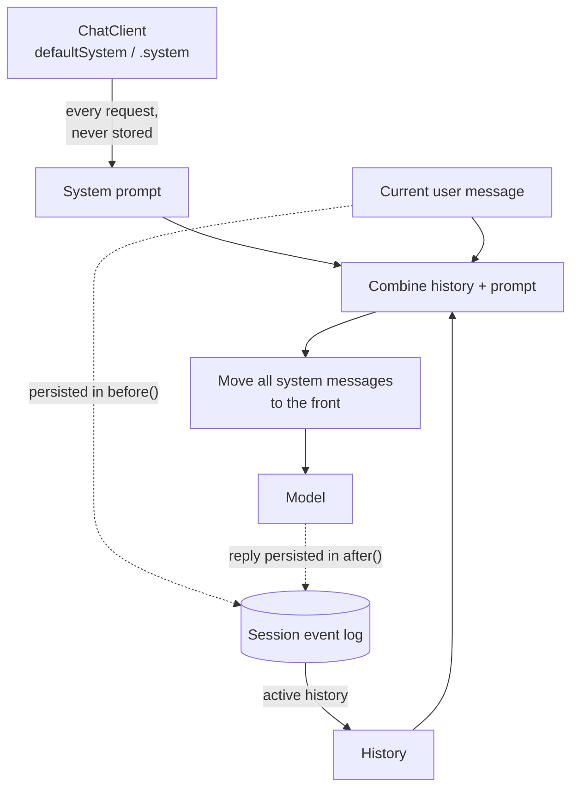
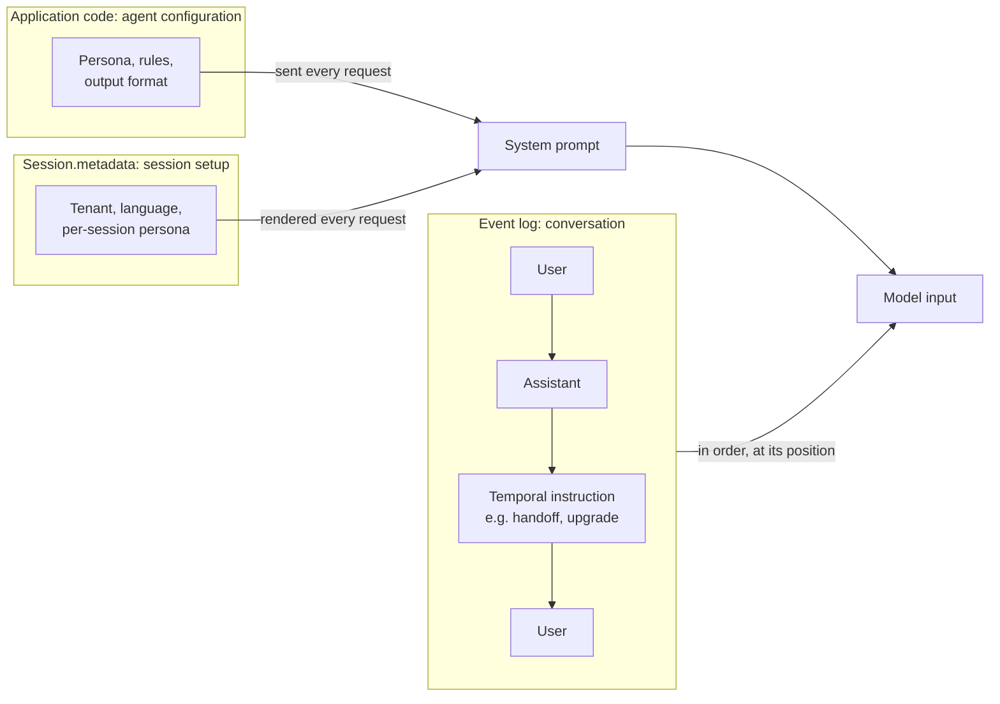
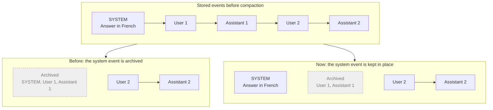

# How Conversation-Memory Frameworks Handle System Messages

*A comparison of 15 frameworks with spring-ai-session. Research date: 2026-09-25. The
spring-ai-session sections describe release 0.10.0 (updated 2026-09-28); the history of how
the rules evolved in 0.9.0 is kept, and [Update for 0.10.0](#update-for-0100) lists what
changed since.*

## Summary

- **Most frameworks send the system prompt with every request and never store it in the
  history.** 11 of 15 work this way, and so does spring-ai-session.
- **Frameworks that do store it need extra rules to keep it correct:** keep one copy,
  replace it when it changes, and protect it from trimming. The known bugs cluster where
  those rules are missing: prompts that go stale, get duplicated, or are trimmed away.
- **Frameworks that keep system messages through trimming protect them explicitly.**
  Protection has to be applied everywhere; Koog protects them in compression but not in
  its memory window.
- **The system prompt should stay stable across a session.** Rewriting it mid-session
  breaks prompt caching (Goose).
- **A system message is usually configuration, not conversation.** The developer writes
  it, it has no position in the exchange, and model APIs take it as a separate input.
  The exception is instructions that happen at a point in time (a handoff, per-turn
  context), which do belong in the conversation. See
  [the argument below](#is-the-system-message-part-of-the-conversation-or-configuration).
- **There is no agreed role for compaction summaries.** User, system, assistant, paired
  forms and out-of-band records are all used.
- **For spring-ai-session:** sending the system prompt per request and moving *all*
  system messages to the front are sound choices. The review found two gaps, and fixing
  them uncovered two more issues; all four were **addressed** in 0.9.0:
  1. System messages stored in the session could be archived by compaction. Now the
     **latest stored system message wins**: compaction keeps it where it was stored and
     never summarizes it, earlier ones are superseded and archived, so per-turn system
     messages stay bounded.
  2. Duplicate system messages were not removed. Exact-text duplicates are now sent once.
  3. Inside a tool-calling loop, a stored system message made the advisor send the whole
     history twice. System messages are now left out of the loop's "already sent" check.
  4. In multi-agent sessions, a sub-agent's system message could leak into the
     orchestrator's prompt and was summarized with its turn. 0.9.0 scoped system messages
     per branch; 0.10.0 removed branches, so each sub-agent now has its own session and
     its own system message. No system message is ever summarized.

  On top of that, **storing system messages is now opt-in** (`allowSystemMessages` /
  `spring.ai.session.allow-system-messages`), and the guidance is in a new "System
  Messages" reference page.

## Scope and method

For each framework, five questions:

1. **Stored?** Is the system prompt saved in the conversation history, or supplied with
   each request?
2. **Placement:** is it forced to the front, and how are several (or changed) system
   messages handled?
3. **Trimming / compaction:** is it kept, and does it count against the budget?
4. **Summary role:** which role does a compaction summary get?
5. **Pitfalls:** known issues.

Findings come from the frameworks' source code (current `main` branches, or a local
checkout for Spring AI) and their official docs. Points marked \* were inferred from
reading the code rather than documented or reported. Line numbers in the sources are
approximate.

## Comparison table

| Framework | System prompt stored in history? | Placement / multiple system messages | During trimming / compaction | Summary stored as |
|---|---|---|---|---|
| **spring-ai-session** | No, sent per request | **All** system messages moved to the front; exact-text duplicates sent once | **Latest stored one wins**: kept in place by every strategy, never summarized; earlier ones superseded and archived | Synthetic **user + assistant** pair |
| Spring AI (upstream) | No, sent per request | Moves only the **first** one to the front; the window keeps one set and **replaces it when a new one arrives** | Never evicted, but counts toward the limit | No summarization |
| LangChain4j | **Yes**, added to memory on every call | **Only one kept**, replaced when it changes; goes first only with `alwaysKeepSystemMessageFirst(true)` (off by default) | Never evicted, counts toward the budget | No summarization in core |
| Koog (JetBrains) | **Yes**, a `Message.System` in the stored prompt; the configured prompt is used only when the history is empty | Anywhere, several allowed; memory context goes into the first one | Compression keeps **all** system messages plus the first user message; ChatMemory `windowSize` / `filterMessages` **can drop it**\* | **Assistant** (TL;DR or `[CONTEXT RESTORATION]` facts) |
| Semantic Kernel | Both: `ChatHistory` stores it; agents inject instructions per call | Plain list | Reducers keep **only the first** one; others lost | Assistant, tagged `__summary__` |
| LangChain / LangGraph | No, prepended per call | Always first | `trim_messages(include_system=True)` protects only index 0 (off by default); v1 summarizer can summarize a stored system message away\* | langmem: **system**; v1 middleware: **user** |
| LlamaIndex | No, a per-request prefix | Prefix first | Buffers evict system messages like any other | **System** |
| AutoGen / MS Agent Framework | No, agent config | AutoGen merges consecutive ones and errors on non-contiguous ones | AutoGen contexts don't protect system messages; Agent Framework defaults to `preserve_system=True` | Assistant (Agent Framework) |
| Pydantic AI | `system_prompt`: **stored once, not re-added**; `instructions`: per request, never stored | Later ones sent as mid-conversation instructions | No built-in trimming; trimming yourself can **lose the system prompt** (known issues) | Assistant (docs example) |
| Haystack | No, skipped on store by default | Current request's system messages go first | Counted per round and can be evicted if stored | No summarization |
| Google ADK | No, rebuilt per request into a separate `system_instruction` field | Joined into one instruction | Never compacted, since it isn't in the event log | Content role `model` |
| OpenAI Agents SDK | No, the running agent's `instructions` per turn | Always first | Not part of trimming | Built-in: opaque compaction items; cookbook: **user + assistant** pair |
| AWS Strands | No, kept apart from `messages` (the snapshot session manager does save it) | A single prompt | Never trimmed | **User** |
| Letta (MemGPT) | **Yes**, a stored system message at index 0 | Always one, **rewritten in place** when memory changes | Always kept, counted in the budget | Own `summary` role, sent to models as **user** |
| Amazon Bedrock AgentCore Memory | No SYSTEM role in the API; sent per request. Strands doesn't store it; LangGraph's store saves it as `OTHER` | No special placement: `OTHER` events stay in timeline order and can repeat | No server-side compaction; client-side paging / `get_last_k_turns`; no pinning | **Memory records**, not messages (XML `<topic>` chunks), which the agent retrieves and injects |
| Goose | No, rebuilt per request; the session stores user/assistant messages only | **One merged** system string, plus a per-turn `<turn-context>` user message (stored, agent-only) for changing context | Auto-compaction at 80%; the prompt is always re-supplied, never summarized; originals **kept but hidden** from the agent | Hidden **user** summary + hidden **assistant** "context was compacted" message, then the last user message re-added |

## Framework notes

### spring-ai-session

- **Stored?** No. `SessionMemoryAdvisor` persists only the prompt's last user (or
  tool-response) message and the model's reply. A system prompt set through
  `ChatClient` (`defaultSystem` / `.system`) is re-sent with every request.
- **Prompt assembly.** The stored history is combined with the current prompt, and every
  `SystemMessage` is moved to the front, keeping their relative order. A system message
  whose text exactly matches an earlier one is sent only once.
- **Tool-calling loops.** When the advisor runs once per tool-call round, it skips
  re-adding history the prompt already carries. System messages are left out of that
  check (their position says nothing, since they always move to the front); stored ones
  are always added and the duplicate from the earlier round is dropped.
- **Storing is opt-in.** `DefaultSessionService` rejects a stored `SystemMessage` with an
  explanatory exception unless `allowSystemMessages(true)` (or
  `spring.ai.session.allow-system-messages=true`) is set. This enforces the per-request
  best practice for integrations that build their own prompts.
- **Stored system messages** (only if the application enables and appends one explicitly):
  - They don't count as turns.
  - The **latest** stored one is the session's system prompt ("latest wins", as in Spring
    AI's `MessageWindowChatMemory` and LangChain4j). Every compaction strategy keeps it
    in the active window, where it was stored, and never summarizes it; it doesn't use
    `maxEvents` / `maxTurns` / `maxEventsToKeep` slots, but counts toward the token-count
    strategy's budget. The advisor sends only that one.
  - Earlier stored ones are superseded and archived when compaction runs.
  - **Multi-agent:** each sub-agent has its own session, so its system message never
    reaches another agent's prompt. (0.9.0 scoped the rule per branch; branches were
    removed in 0.10.0.)
- **Summary:** a synthetic user "shadow prompt" followed by an assistant summary.

How a request is assembled, and what gets persisted:

### Spring AI (upstream)

- **Stored?** No. `MessageChatMemoryAdvisor` stores only user/tool-response messages and
  the model's output.
- **Placement.** The advisor moves only the *first* `SystemMessage` to index 0.
- **Window.** `MessageWindowChatMemory` drops the stored system messages when a new,
  different one arrives. System messages are never evicted but count toward
  `maxMessages`.
- **No summarization.**
- **Known issues:** #4170 (role-alternation error with `defaultSystem` and memory), #873.
- **Sources:** `MessageChatMemoryAdvisor.java`, `MessageWindowChatMemory.java`.

### LangChain4j

- **Stored?** Yes. AI Services add the system message to `ChatMemory` on every call.
- **Placement.** Only one is kept: an identical one is ignored and a different one
  replaces it. It is appended at the end of the list unless
  `alwaysKeepSystemMessageFirst(true)` is set.
- **Trimming.** Never evicted, but counts toward the budget. No summarizing memory in
  core.
- **Known issues:** #140 (duplicate system messages), #1111 (placement), #3542 (proposal
  to make "first" the default).
- **Sources:** [DefaultAiServices.java](https://github.com/langchain4j/langchain4j/blob/main/langchain4j/src/main/java/dev/langchain4j/service/DefaultAiServices.java),
  [chat memory docs](https://docs.langchain4j.dev/tutorials/chat-memory).

### Koog (JetBrains)

- **Stored?** Yes. `AIAgent(systemPrompt=…)` becomes a `Message.System` in the prompt.
  ChatMemory and Persistence checkpoints save the whole message list. On later runs the
  stored history replaces the configured prompt (#1826, fixed by #1835).
- **Placement.** Several system messages are allowed anywhere. Long-term memory injects
  into the first one.
- **Compression** keeps all system messages plus the first user message; the
  `leaveLastNMessages` helpers default to `preserveSystemMessages = true`. ChatMemory's
  `windowSize` and `filterMessages` are plain operations that can drop the prompt\*.
- **Summary:** an assistant TL;DR or `[CONTEXT RESTORATION]` facts.
- **Pitfall\*:** a changed `systemPrompt` doesn't reach existing sessions. #706
  (`FromLastNMessages(1)` stripped the system message) is fixed.
- **Sources:** [JetBrains/koog](https://github.com/JetBrains/koog) (`AIAgentFactory.kt`,
  `ChatMemory.kt`, `HistoryCompressionStrategy.kt`).

### Semantic Kernel

- **Stored?** Both. `new ChatHistory(systemMessage)` stores it, while `ChatCompletionAgent`
  renders `Instructions` per call.
- **Reducers.** Truncation and summarization reducers keep only the *first* system
  message, count it toward the target and put it back in front. Other system messages
  are lost.
- **Summary:** the model's reply, tagged with `__summary__` metadata.
- **Known issues:** #12612 (Python truncation deleted the system prompt, fixed).
  .NET may duplicate a system message that sits in the kept tail\*.

### LangChain / LangGraph

- **Stored?** No. `create_react_agent(prompt=…)` and v1 `create_agent(system_prompt=…)`
  prepend it per call.
- **Trimming.** `trim_messages(include_system=True)` protects only index 0 and counts it
  toward `max_tokens`.
- **Summary.** langmem's `SummarizationNode` re-adds the system message and adds the
  summary as a second SystemMessage. The v1 `SummarizationMiddleware` stores the summary
  as a HumanMessage and can summarize away a system message kept in state\*.
- **Sources:** [chat_agent_executor.py](https://github.com/langchain-ai/langgraph/blob/main/libs/prebuilt/langgraph/prebuilt/chat_agent_executor.py),
  [messages/utils.py](https://github.com/langchain-ai/langchain/blob/master/libs/core/langchain_core/messages/utils.py),
  [langmem summarization.py](https://github.com/langchain-ai/langmem/blob/main/src/langmem/short_term/summarization.py).

### LlamaIndex

- **Stored?** No. `system_prompt` becomes a per-request prefix; memory is fetched with
  the prefix's token count.
- **Trimming.** The buffers evict by age, whatever the role.
- **Summary.** `ChatSummaryMemoryBuffer` stores it as **SYSTEM**. Its `get()` rewrites the
  store.
- **Pitfall\*:** the new `Memory` class injects its blocks into a system message, which
  can result in two system messages.
- **Sources:** [chat_summary_memory_buffer.py](https://github.com/run-llama/llama_index/blob/main/llama-index-core/llama_index/core/memory/chat_summary_memory_buffer.py).

### AutoGen / Microsoft Agent Framework

- **Stored?** No. AutoGen keeps `system_message` apart and prepends it; Agent Framework
  prepends `instructions` per call.
- **Placement.** AutoGen clients merge consecutive system messages and raise an error on
  non-contiguous ones.
- **Trimming.** AutoGen's model contexts don't protect system messages. Agent Framework's
  strategies default to `preserve_system=True`.
- **Summary:** assistant (Agent Framework).
- **Pitfall\*:** `ListMemory` adds a SystemMessage every turn.

### Pydantic AI

- **Stored?** `system_prompt` is generated only when `message_history` is empty (stored
  once, never re-added). `instructions` are applied on every request and never read
  back from history.
- **Pitfall:** trimming history can drop the system prompt; `ReinjectSystemPrompt` exists
  to restore it. Known issues: #1646, #3315, #3579.
- **Source:** [message history docs](https://ai.pydantic.dev/message-history/).

### Haystack

- **Stored?** No. `InMemoryChatMessageStore(skip_system_messages=True)` by default; the
  Agent prepends its `system_prompt` per run.
- **Placement.** The retriever puts the current request's system messages first.
- **Trimming.** `last_k` counts rounds; a stored system message can be evicted. No
  summarization.

### Google ADK

- **Stored?** No. Instructions are rebuilt per request into
  `config.system_instruction`, which isn't part of the event log.
- **Compaction.** Works only on events, so instructions are never compacted. The summary
  has content role `model` on an event authored by `'user'`.
- **Known issue:** #5318 (the compaction call is sent without a system prompt, so
  Anthropic returns 400).
- **Sources:** [_instructions.py](https://github.com/google/adk-python/blob/main/src/google/adk/flows/llm_flows/prompt/_instructions.py),
  [_compaction.py](https://github.com/google/adk-python/blob/main/src/google/adk/flows/llm_flows/context/_compaction.py).

### OpenAI Agents SDK

- **Stored?** No. The running agent's `instructions` are sent per turn (the Responses
  `instructions` param, or a system message at index 0). Sessions store only the run's
  new items.
- **Summary.** The built-in `OpenAIResponsesCompactionSession` produces opaque compaction
  items. The cookbook's `SummarizingSession` uses a synthetic **user + assistant** pair,
  the same pattern as spring-ai-session.
- **Sources:** [sessions docs](https://github.com/openai/openai-agents-python/blob/main/docs/sessions/index.md),
  [cookbook](https://github.com/openai/openai-cookbook/blob/main/examples/agents_sdk/session_memory.ipynb).

### AWS Strands Agents

- **Stored?** No. `system_prompt` is kept apart from `agent.messages`; only the snapshot
  session manager saves it, and restoring a snapshot overrides the constructor's prompt.
- **Trimming.** The conversation managers work only on messages, so the prompt is never
  trimmed.
- **Summary:** role **user**.
- **Source:** [strands-agents/harness-sdk](https://github.com/strands-agents/harness-sdk) (`strands-py/src/strands/agent/conversation_manager/`).

### Letta (MemGPT)

- **Stored?** Yes. The system prompt, including the compiled core-memory blocks, is a
  stored system message pinned at `message_ids[0]` and rewritten in place when memory
  changes.
- **Trimming.** Always kept and counted in the budget. Evicted messages remain searchable
  as recall memory.
- **Summary:** stored with the `summary` role and sent to models as **user**.
- **Source:** [letta (archive branch)](https://github.com/letta-ai/letta/tree/archive) (`agent_manager.py`, `summarizer/`).

### Amazon Bedrock AgentCore Memory

- **No SYSTEM role.** The conversational payload accepts `USER`, `ASSISTANT`, `TOOL` and
  `OTHER` only.
- **Integrations.** Strands' session manager never stores the prompt. LangGraph's store
  maps `SystemMessage` to `OTHER`, so it stays in timeline order and can repeat.
- **Trimming.** No server-side compaction; `ListEvents` paging and `get_last_k_turns`
  run on the client.
- **Summary.** The summary strategy writes XML `<topic>` memory records that the agent
  retrieves and injects, either into a per-request system message or into the latest
  user message.
- **Sources:** [Conversational API](https://docs.aws.amazon.com/bedrock-agentcore/latest/APIReference/API_Conversational.html),
  [summary strategy](https://docs.aws.amazon.com/bedrock-agentcore/latest/devguide/summary-strategy.html),
  [bedrock-agentcore-sdk-python](https://github.com/aws/bedrock-agentcore-sdk-python).

### Goose

- **Stored?** No. The prompt is rebuilt on each request from `system.md`, extension
  instructions and `.goosehints` / `AGENTS.md`, merged into one system string.
- **Per-turn context.** Changing context (time, working directory, turn budget) goes into
  a per-turn `<turn-context>` user message marked agent-only.
- **Compaction.** Runs at 80% of the context limit. Originals are kept but hidden from the
  agent. The summary is a hidden user message followed by a hidden assistant
  "context was compacted" message.
- **Known issues:** #11839 (rewriting the prompt broke caching and Anthropic thinking),
  #4610, #12521.
- **Source:** [aaif-goose/goose](https://github.com/aaif-goose/goose) (`prompt_manager.rs`,
  `context_mgmt/mod.rs`, `summarize.rs`).

## Patterns

1. **Per request vs. stored.** 11 of 15 frameworks send the system prompt per request.
   The four that store it are LangChain4j, Koog, Letta and Pydantic AI's `system_prompt`.
   Storing creates a stale-prompt risk: Koog and Pydantic AI don't pick up a changed
   prompt in existing sessions. LangChain4j avoids it by replacing on change, and Letta
   by explicit rebuilds.
2. **Protection during trimming.** Spring AI, LangChain4j, Letta, Semantic Kernel (first
   only), Agent Framework and Koog's compression protect system messages. LlamaIndex
   buffers, AutoGen contexts, Haystack, a naive Pydantic AI trim and Koog's ChatMemory
   window don't.
3. **Prompt stability.** Goose moves everything that changes per turn out of the system
   prompt, because rewriting it breaks prompt caching.
4. **Summary role.**
   - user: Strands, Letta (sent as user), LangChain v1, Goose
   - system: LlamaIndex, langmem
   - assistant/model: Semantic Kernel, Agent Framework, Koog, ADK
   - user + assistant pair: OpenAI cookbook, Goose, spring-ai-session
   - out-of-band records: AgentCore

## Common pitfalls

| Pitfall | Seen in |
|---|---|
| Duplicate system messages (stored *and* sent per request) | LangChain4j #140, Haystack\*, LlamaIndex `Memory`\*, AutoGen `ListMemory`\* |
| System prompt lost when trimming | Pydantic AI #1646 / #3315 / #3579, Semantic Kernel #12612, Koog #706 |
| Stale prompt after a configuration change | Koog\*, Pydantic AI, Strands snapshot restore |
| System prompt stranded mid-history | AgentCore via LangGraph (`OTHER`), Spring AI #873 |
| Summarizer call without a system prompt breaks providers | Google ADK #5318 |
| Prompt rewritten mid-session breaks caching | Goose #11839, #4610 |
| Moving system messages to the front defeats position-based checks (history re-sent in a tool loop) | spring-ai-session (0.8.0 loop check; fixed in 0.9.0) |
| One agent's system message leaks into another agent's prompt (multi-agent) | spring-ai-session (found in review; fixed in 0.9.0, and a session per sub-agent since 0.10.0) |

## Is the system message part of the conversation, or configuration?

The frameworks disagree less about mechanics than about this question. Where a framework
lands on it determines everything in the comparison table: whether the prompt is stored,
whether it can be trimmed, and whether a change reaches existing sessions.

### What is a conversation?

A conversation is the record of an exchange between its **participants**: the user, the
assistant, and the tools the assistant calls. Each entry is something a participant
*said or did at a point in time*, and its position in the sequence carries meaning. That
is what the conversation-memory frameworks store, window, summarize and search.

A system message is written by a different party, the **developer or operator** who
deploys the agent. It usually describes *how the assistant should behave* rather than
recording *what was said*. The question is whether that makes it part of the exchange or
part of the setup around it.

### The case for configuration

- **Different author.** No participant says it. The developer writes it, usually in
  code or a template.
- **Different lifecycle.** It is versioned and deployed with the application, changes
  independently of any session, and applies to every session at once. Conversation
  entries are created per session and never change.
- **No meaningful position.** "Always answer in English" means the same at turn 1 and
  turn 50. It has no "when".
- **The model APIs treat it as a separate input.** Anthropic's `system` parameter,
  Gemini's `system_instruction` and the Responses API `instructions` all sit outside the
  message list. OpenAI's renaming to a `developer` role names the author, not a
  participant.
- **The frameworks mostly agree.** 11 of 15 re-send it per request and never store it.
- **Treating it as conversation causes the recorded bugs.**
  - Stored prompts go stale after a change (Koog, Pydantic AI, Strands snapshots).
  - They get duplicated when also sent per request (LangChain4j #140).
  - They get trimmed or summarized away (Pydantic AI, Semantic Kernel #12612, Koog #706).
  - A prompt that is rewritten in the history breaks prompt caching (Goose #11839).
- **It isn't meaningful summary material.** Summarizing "the rules" into a narrative
  loses their force. Compaction should shorten what was said, not how the agent is told
  to behave.

### The case for conversation

- **Some instructions do happen at a point in time.** "The user just upgraded to
  premium", "you are now handed off to the billing agent", "the working directory
  changed" or "retrieved facts for this turn" are events whose position matters. Pydantic
  AI calls these mid-conversation system prompts, and Goose sends them as per-turn
  context messages.
- **Some state lives in the prompt.** In Letta, the system prompt holds the agent's
  core memory, which is derived from the conversation and changes as the conversation
  goes on.
- **Audit and reproducibility.** To explain a past reply you need to know which
  instructions produced it. If the prompt isn't stored, you can't reconstruct the exact
  model input later.
- **Per-session setup.** A session may be created with its own instructions (a tenant,
  a language, a persona) that must survive restarts and apply only to that session.

### Resolution: three kinds of instruction

Both sides are right about different kinds of instruction:

| Kind | Example | What it is | Where it belongs |
|---|---|---|---|
| **Agent configuration** | persona, rules, output format, tool-usage policy | Configuration that applies to every session | Sent per request from code (`ChatClient.defaultSystem`). Not stored. For audit, record a version or hash in the event metadata, not the text |
| **Session-scoped setup** | tenant, language, per-session persona chosen at creation | Configuration for one session | Stored as **session metadata** (spring-ai-session's `Session.metadata`) and rendered into the system prompt per request. Not an event |
| **Temporal instruction** | upgrade happened, handoff, per-turn retrieved context | A conversation event | Stored **in the event log at its position**. Best sent as user- or tool-shaped context (as Goose does), because many providers accept a system message only at the start |

Where each kind lives, and how it reaches the model:

Seen this way, the gaps and mismatches in the comparison table come from mixing these
kinds. Storing agent configuration as an event leads to stale, duplicated and trimmed
prompts. Hoisting a temporal instruction to the top of the prompt loses when it
happened.

### What this means for spring-ai-session

- **The per-request design treats the system prompt as agent configuration.** That is
  the right default.
- **There was a tension in the 0.8 behavior.** A `SYSTEM` event stored in the session
  has a position in the log, but the advisor moves every system message to the front,
  which throws that position away. So the advisor already treats stored system messages
  as **configuration**, not as temporal events.
- **Two consistent options:**
  1. *Stored system messages are session configuration* (recommended). Keep moving them
     to the front, protect them from compaction (gap 1 below), and remove duplicates
     (gap 2). Document that temporal instructions should be stored as user-shaped
     context messages instead.
  2. *Stored system messages are temporal events.* Stop moving them to the front, and
     render them in place as user-shaped context. That preserves their meaning but
     breaks providers that allow a system message only at the start.
- **Session-scoped setup has a better home than the event log.** `Session.metadata`
  already exists. An application can render it into the system prompt on each request,
  so it never becomes an event that can be archived.
- **Optional audit hook.** Record a hash or version of the system prompt in each
  assistant event's metadata. That makes a past reply reproducible without storing the
  prompt text in the conversation.

**Outcome:** option 1 was implemented. Storing system messages is opt-in, and a stored
system message is treated as configuration: the latest one is the system prompt, protected
from compaction and never summarized, and the advisor moves it to the front of the prompt.
Since 0.10.0 compaction also keeps it at its position in the log, so the log itself is
never reordered.
Time-bound instructions are best sent per request (see the "System Messages" reference
page).

## Implications for spring-ai-session

**Already sound:**

- The system prompt is sent per request and never stored, which is the majority design
  and avoids stale and duplicated prompts.
- *All* system messages are moved to the front. That is more robust than upstream Spring
  AI, which moves only the first one.
- The advisor re-sends the system prompt unchanged, which keeps prompt caching intact.

**Gaps** (all addressed in 0.9.0, following option 1 above, where stored system messages
are session configuration; the per-branch details were superseded in 0.10.0):

1. **Stored system messages could be compacted away.** The sliding-window, token-count and
   recursive-summarization strategies archived a stored `SYSTEM` event like any other
   event. The turn-window strategy kept one only if it came before the first user
   message.
   - *Fix:* the **latest** stored `SYSTEM` event is the system prompt. Every strategy
     keeps it (never summarized, no count-based slots, tokens deducted from the token
     budget) and archives earlier ones as superseded. `SessionMemoryAdvisor` sends only
     the latest one. In 0.9.0 the rule applied per branch and strategies placed the kept
     message first in the active window; since 0.10.0 there are no branches and it stays
     where it was stored.
   - *How the rule evolved:* a first version pinned every stored system message; a code
     review showed that an app storing one per turn would grow the prompt without limit.
     A second version pinned only those stored before the first user message, but that
     made the session's prompt impossible to update. "Latest wins" is bounded (at most one
     active), lets an integrator update the prompt by storing a new complete one, and
     matches the replace-on-change behaviour of Spring AI and LangChain4j. Putting the
     right content in it is the integrator's responsibility. In 0.9.0 the rule was first
     applied to root-level messages only, then extended to every branch (item 4); 0.10.0
     removed branches.

   A sliding window with `maxEvents = 2`, before and after the fix:

2. **No dedupe.** A stored system message identical to the per-request one was sent
   twice.
   - *Fix:* `SessionMemoryAdvisor` now keeps only the first occurrence of each exact
     system message text. Texts are never merged, since changing the prompt would break
     caching.

3. **History re-sent inside a tool-calling loop** (found by a code review of the fixes
   above; the underlying check dates from 0.8.0). When the advisor runs once per
   tool-call round, it skips re-adding history only if the stored history appears as one
   unbroken run in the prompt. Because every system message is moved to the front, a
   stored system message plus the request's own system prompt (the usual
   `defaultSystem` case) broke that run, and from round 2 on the whole conversation was
   sent twice.
   - *Fix:* system messages are left out of the check on both sides. Stored system
     messages are always added, and the exact-text dedupe (gap 2) drops the copy from the
     earlier round.
   - *Lesson:* moving system messages to the front has a cost. Any logic that relies on
     message *positions* must ignore system messages. This is the same configuration vs.
     conversation distinction as above: system messages are configuration, so they carry
     no position in the conversation.

4. **Sub-agent system messages were handled inconsistently** (found while reviewing the
   fixes above). The advisor picked the latest stored system message from whatever history
   it loaded, so an orchestrator, which loads every branch, could use a sub-agent's
   instructions as its own prompt. Compaction treated sub-agent system messages as part of
   their turn: archived with it, and summarized by the recursive strategy.
   - *Fix (0.9.0):* system messages are configuration at every level, scoped by branch.
     Each agent used the latest system message stored on its own branch, compaction kept
     the latest one of every branch, and no system message was ever summarized.
   - *Superseded (0.10.0):* branch support was removed. Each sub-agent gets its own
     session, so its system message is simply that session's latest one.

**Additional changes:**

- **Storing is opt-in.** `DefaultSessionService` rejects a stored `SystemMessage` unless
  `allowSystemMessages(true)` or `spring.ai.session.allow-system-messages=true` is set. The
  exception explains how to supply the prompt per request instead, and how to opt in.
  `SessionMemoryAdvisor` never stores system messages, so `ChatClient` users are
  unaffected.
- **Library vs. integration responsibilities** are documented separately: the library
  stores and compacts events (the same for every integration), while whatever builds the
  prompt must supply the system prompt, use the latest stored one, put system messages
  first, drop duplicates and avoid re-sending history in loops.

**Documented:** the recommended pattern is to supply system prompts per request (with
`ChatClient` `defaultSystem` / `.system`, or from your own prompt builder) and keep the
session for conversation only. Per-session instructions belong in `Session.metadata`,
rendered into the system prompt on each request. Storing a system message is an opt-in
fallback: the latest stored one is the system prompt, and storing a new complete one
replaces it. This guidance is in the reference docs as the "System
Messages" page (`docs/session-management/system-messages.md`).

## Update for 0.10.0

What changed in spring-ai-session after the 0.9.0 release, as it affects system messages:

- **Branches removed** (#51, #54). There is one latest stored system message per session,
  not one per branch, and it counts fully toward the token-count budget. Multi-agent
  applications give each sub-agent its own session, and with it its own system message.
  The reasoning is in `design/reports/multi-agent-branch-report.md`.
- **Compaction never reorders the log** (#56). The kept system message stays where it was
  stored instead of moving to the front of the active window. Only the prompt builder
  (`SessionMemoryAdvisor`, or a custom loop) puts system messages first, which matches the
  "configuration, not conversation" position above: its place in the log is kept for the
  record, and it has no position in the prompt.
- **The tool-loop check compares messages by content** (#52, in 0.9.0). The fix for gap 3
  relied on `Message.equals`, which failed with the JDBC repository because it doesn't
  store message metadata; messages are now compared by type, text, tool calls and tool
  responses.
