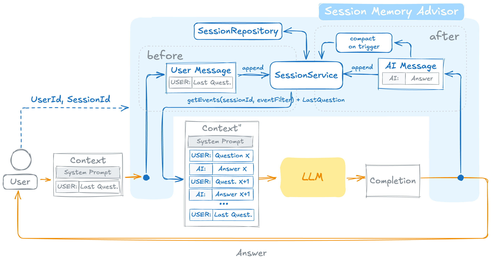

# ChatClient Integration

`SessionMemoryAdvisor` is the primary integration point between Spring AI Session and a
`ChatClient`. It wires session management into the ChatClient pipeline transparently —
no manual history loading or appending required in application code.

---

## What the advisor does

On every request the advisor:

1. Resolves the session ID from `SESSION_ID_CONTEXT_KEY`, which **must** be present on
   every request, creating the session if it does not exist and checking ownership if it
   does (see [Passing a session ID per request](#passing-a-session-id-per-request)).
2. Loads the session's history with the configured `eventFilter` (default
   `EventFilter.all()`), merged with any per-request `EVENT_FILTER_CONTEXT_KEY` filter, and
   **prepends** it to the prompt. `EventFilter.active()` is always merged in on top, so
   archived (compacted-out) events never reach the prompt. Of any stored system messages
   (an opt-in), only the latest one is kept.
3. Moves all `SystemMessage`s to the front, in their relative order, and sends a text that
   exactly matches an earlier one only once. Texts are never merged or rewritten, so the
   prompt stays stable for prompt caching. See [System Messages](../session-management/system-messages.md).
4. Appends the prompt's last user message to the session, if the configured
   `MessageFilter` accepts it. Inside a tool-calling loop this is the trailing
   tool-response message instead (`Prompt.getLastUserOrToolResponseMessage()`).
5. After the model responds, appends the assistant message(s) through the configured
   `MessageFilter` (default: `MessageFilter.skipEmptyMessages()`). By default, empty
   assistant messages (blank text, no tool calls, and no media) are skipped — some
   models (e.g. Bedrock Converse) emit an empty `end_turn` frame after tool use that
   would otherwise be replayed and rejected on the next request.
6. If a trigger fires, runs compaction **synchronously** before returning — the full turn
   (user + assistant) is already written at this point, so there is no race between
   compaction and message appending.

The diagram below shows the round-trip: the **before** phase loads history and builds the
expanded prompt, the **after** phase appends the assistant message and compacts on trigger.



---

## Setup

```java
SessionMemoryAdvisor advisor = SessionMemoryAdvisor.builder(sessionService)
    .defaultUserId("alice")
    // Compact when 20 turns accumulate, using LLM summarization to retain context
    .compactionTrigger(new TurnCountTrigger(20))
    .compactionStrategy(
        RecursiveSummarizationCompactionStrategy.builder(chatClient)
            .maxEventsToKeep(10)
            .build()
    )
    .build();

ChatClient client = ChatClient.builder(chatModel)
    .defaultAdvisors(advisor)
    .build();
```

!!! warning "Session ID is required on every request"
    `SESSION_ID_CONTEXT_KEY` must be set in the advisor context on every call.
    Omitting it throws `IllegalStateException`. This is intentional — a shared fallback
    session ID would silently merge history across different users.

!!! warning "Trigger and strategy must be set together"
    Setting only one of `compactionTrigger` or `compactionStrategy` makes `build()` throw
    `IllegalArgumentException`. Set both or neither.

!!! note "Default advisor order — nested inside the tool-calling loop"
    The default order is `Ordered.HIGHEST_PRECEDENCE + 1000`, a lower precedence than
    `ToolCallingAdvisor`'s `HIGHEST_PRECEDENCE + 300`. The tool-calling advisor therefore
    wraps `SessionMemoryAdvisor`, whose `before()`/`after()` run once per round of the
    tool-call loop.

    This is deliberate and safe. From round 2 on, `before()` finds its loaded history
    already present as a contiguous run in the prompt and doesn't prepend it again. Messages
    are compared by content (type, text, tool calls and tool responses), not `equals`, so the
    check also works when the repository doesn't store message metadata, as with JDBC. System
    messages are left out of this check, because they are always moved to the front; the
    exact-text duplicate of a stored one is dropped. Only each round's trailing
    user/tool-response message and the model's reply are persisted, so nothing is stored
    twice either. You don't need `.disableInternalConversationHistory()` on the
    tool-calling advisor.

    Set `.order(n)` below the tool-calling advisor's order if `SessionMemoryAdvisor` should
    instead wrap the loop and write to the session once, after tool results are resolved.

---

## Idempotent session-event ids {#idempotent-session-event-ids}

By default every persisted event gets a random id, so a retried write always creates a
new event. Configure `requestEventIdGenerator`/`responseEventIdGenerator` to derive a
deterministic id instead — a retry with the same id becomes a no-op (see [Idempotent
`appendEvent`](../session-management/concepts.md#idempotent-appendevent)):

```java
IdempotentSessionEventIdGenerator idGenerator = new IdempotentSessionEventIdGenerator();

SessionMemoryAdvisor advisor = SessionMemoryAdvisor.builder(sessionService)
    .requestEventIdGenerator(idGenerator)
    .responseEventIdGenerator(idGenerator)
    .build();
```

`IdempotentSessionEventIdGenerator` derives each id from two parts:

- **The message.** For tool calls and tool responses it uses the model's tool-call ids. If
  any of those ids is blank (some providers, such as Ollama, don't assign them), it uses
  the tool names, arguments and response data instead. For every other message it uses
  the message text.
- **A context fingerprint.** These are the values of a list of advisor-context keys. The
  default is just the session id.

Both parts are hashed into an id of the form `<messageType>-<sha256>`, at most 74
characters, which fits the JDBC `VARCHAR(255)` column.

!!! warning "Identical messages collide"
    With the default session-scoped fingerprint, two identical messages anywhere in the
    same session get the same id, and the second is dropped as a replay. For example, a
    user answering "yes" twice loses the second "yes". To avoid this, add a context key
    that changes per request, such as a durable run id. The varargs constructor
    *replaces* the default key list, so include the session key yourself:

    ```java
    new IdempotentSessionEventIdGenerator("run-id", SessionMemoryAdvisor.SESSION_ID_CONTEXT_KEY);
    ```

To write your own generator, implement `SessionEventRequestIdGenerator` and/or
`SessionEventResponseIdGenerator`. The defaults are `SessionEventRequestIdGenerator.random()`
and `SessionEventResponseIdGenerator.random()`.

---

## Passing a session ID per request

Pass a session ID at call time via the advisor context:

```java
String response = client.prompt()
    .user("Hello!")
    .advisors(a -> a.param(SessionMemoryAdvisor.SESSION_ID_CONTEXT_KEY, "session-abc"))
    .call()
    .content();
```

If no session exists for the given ID, the advisor creates one automatically using the
`USER_ID_CONTEXT_KEY` value from the request context, falling back to `defaultUserId`.
`defaultUserId` defaults to `"default-user"`, so set one of them if you later look
sessions up by user, e.g. with `findByUserId` or `CrossSessionRecallTools`.

!!! note "Ownership enforcement"
    When `USER_ID_CONTEXT_KEY` is present and the session already exists, the advisor
    checks that the supplied user ID matches `session.userId()`. A mismatch throws
    `IllegalStateException` — this prevents one user from reading or appending to
    another user's session if session IDs are ever guessable or shared.

    The check is **skipped** when `USER_ID_CONTEXT_KEY` is absent so that callers
    which rely solely on `defaultUserId` (or do their own authorization upstream) are
    not affected.

    ```java
    client.prompt()
        .user("Hello!")
        .advisors(a -> a
            .param(SessionMemoryAdvisor.SESSION_ID_CONTEXT_KEY, "session-abc")
            .param(SessionMemoryAdvisor.USER_ID_CONTEXT_KEY, "alice")  // enforced
        )
        .call()
        .content();
    ```

---

## Context keys

| Key constant | String value | Purpose |
|---|---|---|
| `SESSION_ID_CONTEXT_KEY` | `"chat_memory_conversation_id"` (= `ChatMemory.CONVERSATION_ID`) | Routes the request to a session |
| `USER_ID_CONTEXT_KEY` | `"chat_memory_user_id"` | Used when auto-creating a session; also enforces ownership on existing sessions when set |
| `EVENT_FILTER_CONTEXT_KEY` | `"chat_memory_event_filter_id"` | Per-request `EventFilter` merged with the advisor-level filter |

---

## Per-request filter override

Pass an `EventFilter` via `EVENT_FILTER_CONTEXT_KEY` to narrow or adjust history
retrieval on a single call without reconfiguring the advisor:

```java
// Advisor is configured with EventFilter.all() (default).
// This request overrides to see only the last 5 events.
String response = client.prompt()
    .user("Quick summary please")
    .advisors(a -> a
        .param(SessionMemoryAdvisor.SESSION_ID_CONTEXT_KEY, sessionId)
        .param(SessionMemoryAdvisor.EVENT_FILTER_CONTEXT_KEY, EventFilter.lastN(5))
    )
    .call()
    .content();
```

`EventFilter.merge()` semantics: every non-null field from the request filter replaces
the corresponding field from the advisor default; the two boolean flags, `excludeSynthetic`
and `excludeArchived`, are OR-ed so either side can opt in. A request-level `lastN` or
`page`/`pageSize` replaces the advisor's retrieval modifier as a whole (see
[Merging filters](../session-management/event-filtering.md#merging-filters)). A `null` value for
`EVENT_FILTER_CONTEXT_KEY` is ignored.

---

## Filtering what gets persisted (`MessageFilter`)

While `EventFilter` controls which **stored** events are loaded into the next prompt,
`MessageFilter` controls which messages get **stored at all**. A message rejected by the
filter is never persisted and therefore never replayed on later requests. The outgoing
prompt is unaffected — filtering applies to persistence only.

| | `EventFilter` (read side) | `MessageFilter` (write side) |
|---|---|---|
| Applies when | Loading history in `before()` | Appending messages in `before()` / `after()` |
| Operates on | Stored `SessionEvent`s | `Message`s about to be persisted |
| Rejected items | Stay in storage, hidden from the prompt | Never written to storage |

Configure it on the builder:

```java
SessionMemoryAdvisor advisor = SessionMemoryAdvisor.builder(sessionService)
    // Persist only user and assistant messages (e.g. keep verbose tool
    // responses out of the session log), still skipping empty frames.
    .messageFilter(
        MessageFilter.byMessageType(MessageType.USER, MessageType.ASSISTANT)
            .and(MessageFilter.skipEmptyMessages())
    )
    .build();
```

Built-in factories:

| Factory | Behavior |
|---|---|
| `MessageFilter.all()` | Persists every message (no filtering) |
| `MessageFilter.skipEmptyMessages()` | Skips assistant messages with blank/null text, no tool calls, and no media (**the default**) |
| `MessageFilter.byMessageType(types...)` | Persists only the listed `MessageType`s |
| `MessageFilter.containsText(keyword)` | Persists only messages whose text contains the keyword (case-insensitive) |

`MessageFilter` is a `@FunctionalInterface`, so a lambda works too, and filters compose
via `and()`, `or()`, and `negate()`:

```java
// Never persist messages containing "confidential"
.messageFilter(
    MessageFilter.containsText("confidential").negate()
        .and(MessageFilter.skipEmptyMessages())
)
```

!!! warning "Compose, don't replace"
    Setting a custom `messageFilter` **replaces** the default
    `skipEmptyMessages()` protection. If you still want empty assistant frames
    filtered out (recommended — some models reject them when replayed as history),
    compose your filter with it via `.and(MessageFilter.skipEmptyMessages())`.

---

## Concurrent compaction safety

Concurrent `after()` calls on the same session (e.g. parallel fan-out) may both compact;
the [optimistic compare-and-swap](../session-management/concepts.md#optimistic-concurrency) makes the loser skip
silently, so no compacted result is lost or corrupted.

---

## Scheduler pinning

Both the blocking (`advise()`) and streaming (`adviseStream()`) paths run `before()` and
`after()` on the configured `Scheduler` (default: `BaseAdvisor.DEFAULT_SCHEDULER`). In
`adviseStream()`, a second `.publishOn(scheduler)` is applied after
`.flatMapMany(chain::nextStream)` so that the aggregation callback and compaction always
run on the scheduler rather than the LLM streaming thread.
