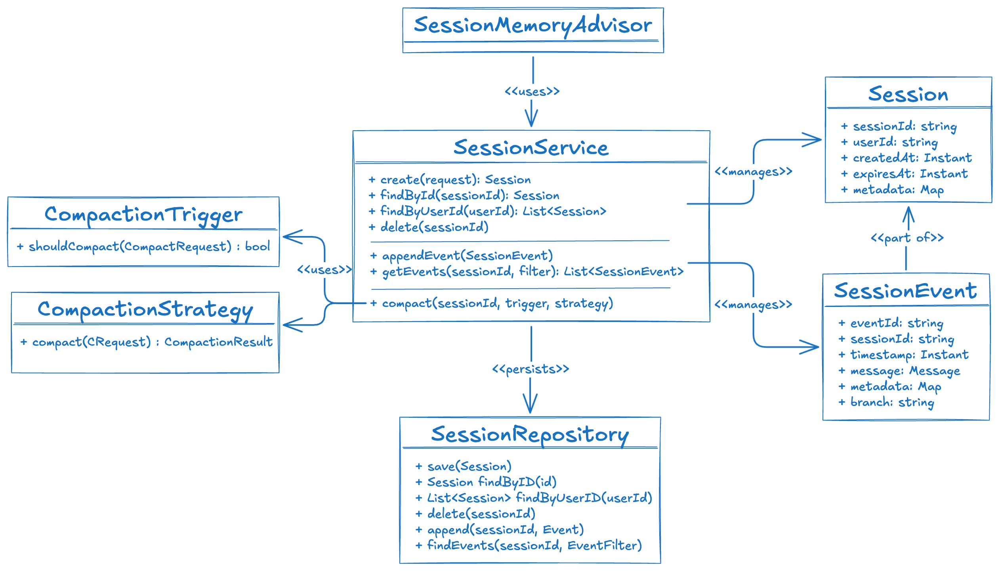

# Spring AI Session

**Spring AI Session** is a structured, event-sourced conversation memory layer for
[Spring AI](https://docs.spring.io/spring-ai/reference/) applications.

Most AI frameworks store conversation history as a flat list of messages. That works for
short, simple conversations — but as sessions grow, you hit a hard limit: the model's
context window. The naive solution is to truncate the oldest messages, but that breaks
tool-call sequences, discards coherent turns mid-conversation, and throws away context
the model may still need.

Spring AI Session solves this with three ideas working together:

1. **Structured events** — every message is a `SessionEvent` with a unique id, timestamp,
   session ownership, and optional branch label for multi-agent hierarchies.
2. **Turn-aware compaction** — configurable triggers fire when the history grows too large,
   and pluggable strategies decide what to keep, always respecting turn boundaries so the
   model never sees an orphaned tool result or a half-finished exchange.
3. **Persistent repositories** — a clean SPI (`SessionRepository`) makes it trivial to
   swap the default in-memory store for JDBC, Redis, or any other backend without
   changing application code.



---

## Modules

| Module | Artifact | Description |
|--------|----------|-------------|
| **Session Management** | `spring-ai-session-management` | Core SPI: `Session`, `SessionEvent`, `SessionService`, `SessionRepository`, compaction framework, `SessionMemoryAdvisor` |
| **Session JDBC** | `spring-ai-session-jdbc` | JDBC-backed `SessionRepository` for PostgreSQL, MySQL, H2, and MariaDB |
| **Session Auto-configuration** | `spring-ai-autoconfigure-session` | Spring Boot auto-configuration for `DefaultSessionService` (repository-agnostic) |
| **Session JDBC Auto-configuration** | `spring-ai-autoconfigure-session-jdbc` | Spring Boot auto-configuration for the JDBC repository |
| **Session JDBC Starter** | `spring-ai-starter-session-jdbc` | Spring Boot starter — one dependency for a fully wired JDBC session setup |
| **Session BOM** | `spring-ai-session-bom` | Bill of Materials for managing all module versions together |

---

## Key Features

- **Event-sourced conversation log** — append-only, immutable `SessionEvent` records
  wrapping Spring AI `Message` types
- **Composable event filtering** — filter by message type, time range, keyword, branch,
  last-N, or pagination
- **Four compaction strategies** out of the box:
    - `SlidingWindowCompactionStrategy` — keep the last N real events
    - `TurnWindowCompactionStrategy` — keep the last N complete turns
    - `TokenCountCompactionStrategy` — keep a token-budget-bounded suffix
    - `RecursiveSummarizationCompactionStrategy` — LLM-powered rolling summary
- **Two compaction triggers**: turn count and token count (composable with OR semantics)
- **Turn-boundary safety** — the kept window always starts at a `USER` message; no orphaned
  tool results or split turn sequences
- **Optimistic concurrency** — compare-and-swap `replaceEvents` makes compaction safe under
  concurrent requests without locking
- **Multi-agent branch isolation** — dot-separated branch labels let peer sub-agents share
  one session while hiding each other's events
- **Recall storage tool** — `SessionEventTools` gives the model a `conversation_search`
  tool to keyword-search the full verbatim history even after compaction
- **Spring Boot auto-configuration** for the JDBC repository (schema init, dialect
  detection, `JdbcSessionRepository` bean)

---

## Quick Example

```java
// 1. Create the service
SessionService service = new DefaultSessionService(InMemorySessionRepository.builder().build());

// 2. Create a session
Session session = service.create(
    CreateSessionRequest.builder().userId("alice").build()
);

// 3. Wire it into a ChatClient
SessionMemoryAdvisor advisor = SessionMemoryAdvisor.builder(service)
    .defaultSessionId(session.id())
    .defaultUserId("alice")
    .compactionTrigger(new TurnCountTrigger(20))
    .compactionStrategy(new SlidingWindowCompactionStrategy(10))
    .build();

ChatClient client = ChatClient.builder(chatModel)
    .defaultAdvisors(advisor)
    .build();

// Every call automatically loads history, appends messages, and compacts when needed
String answer = client.prompt().user("What is Spring AI?").call().content();
```

---

## Requirements

- Java 17+
- Spring AI `2.0.0-M4+`
- Spring Boot `4.0.2+`

---

## Links

- [GitHub](https://github.com/spring-ai-community/spring-ai-session)
- [Issues](https://github.com/spring-ai-community/spring-ai-session/issues)
- [Spring AI Reference](https://docs.spring.io/spring-ai/reference/)
