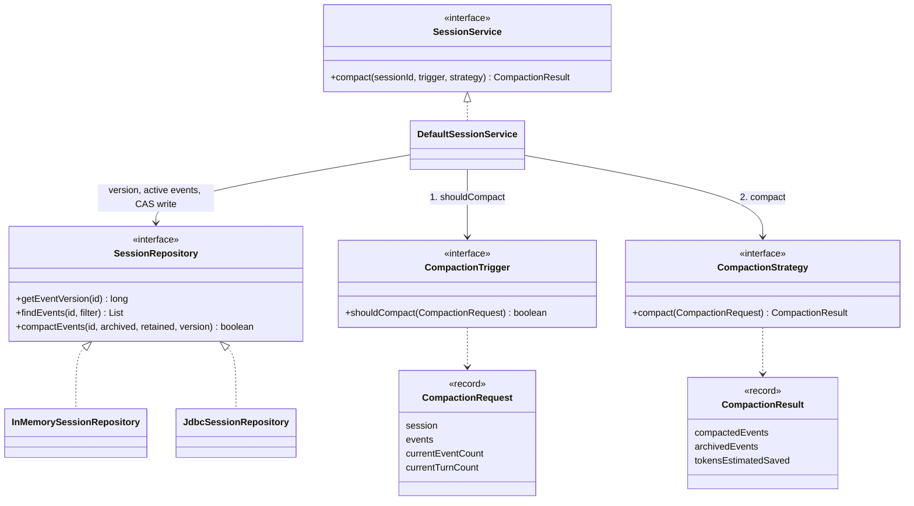
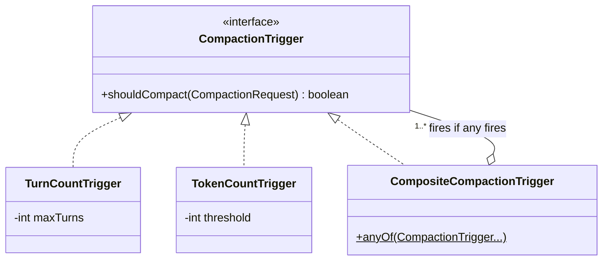
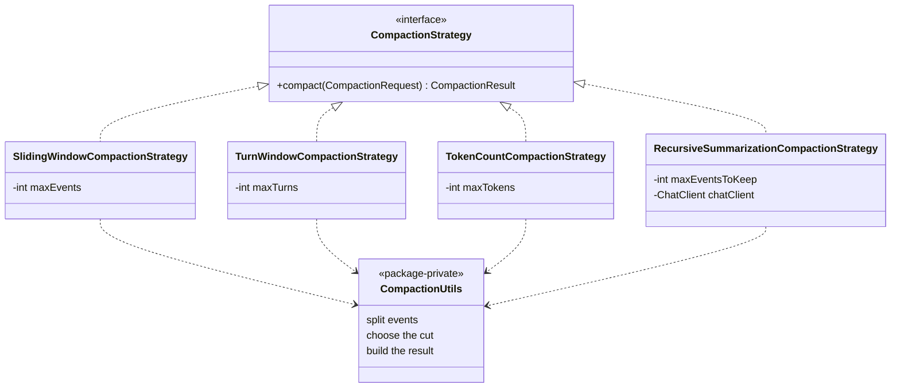
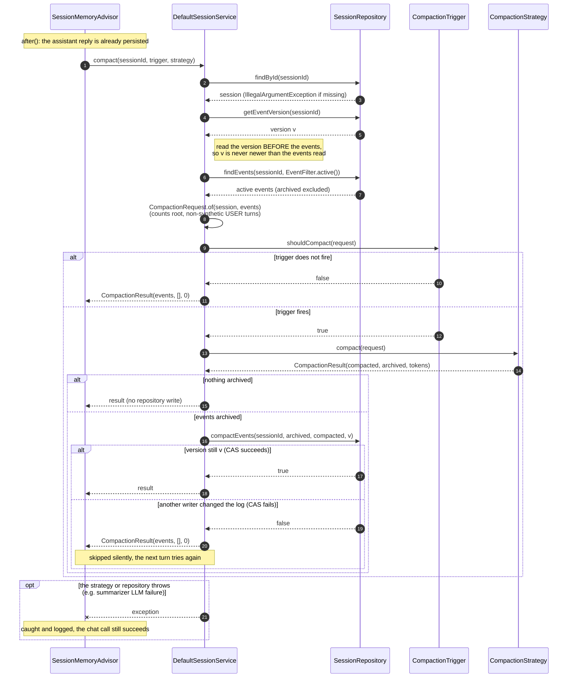
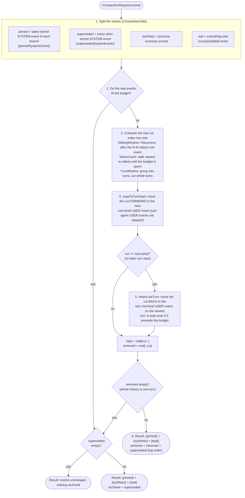
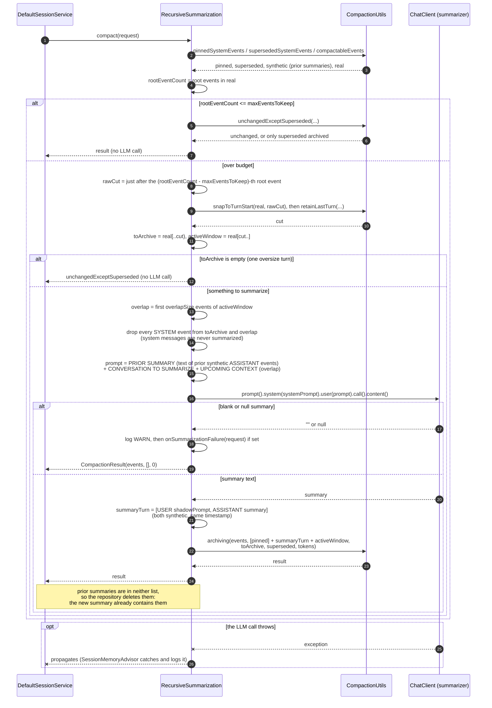
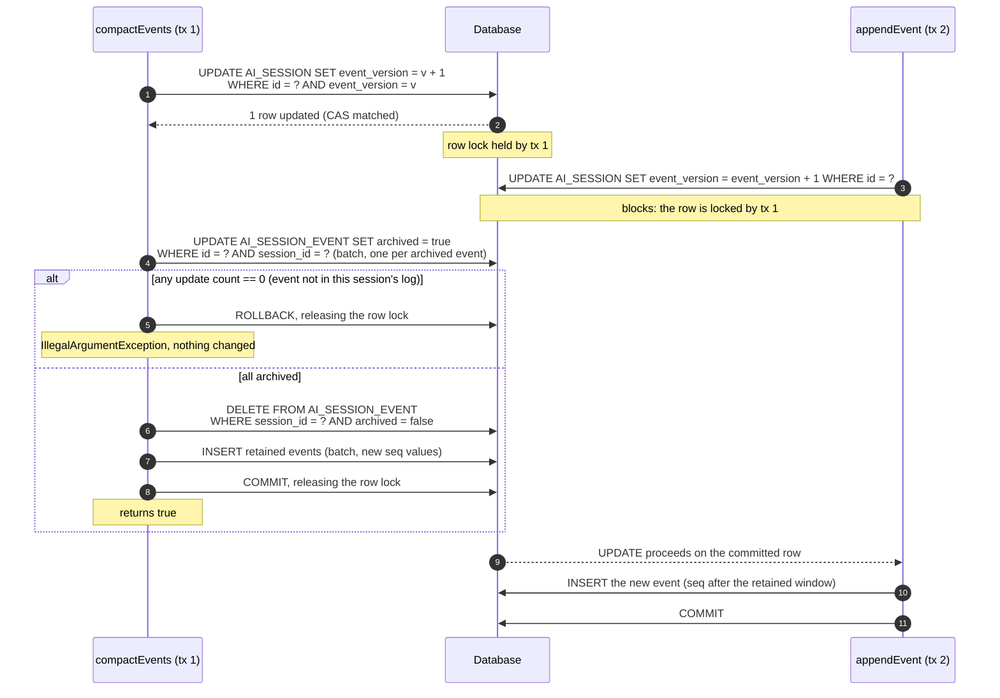

# Compaction Internals

This page explains **how** context compaction works inside Spring AI Session, with class,
sequence and activity diagrams and worked examples. For **using** compaction (choosing
and configuring triggers and strategies), see [Context Compaction](compaction.md).

The focus is on the complicated cases: the optimistic-concurrency (CAS) write, the
cut-point algorithm with turn snapping, the recursive summarization strategy, stored
system messages, and concurrent appends on JDBC.

!!! note "Implementation details"
    This page describes the current implementation. Package-private helpers such as
    `CompactionUtils` and the exact SQL used by `JdbcSessionRepository` are not public API
    and may change between releases. The public contract is `CompactionTrigger`,
    `CompactionStrategy`, `CompactionRequest`, `CompactionResult`,
    `SessionService.compact(...)` and `SessionRepository.compactEvents(...)`.

## Contents

1. [Class diagrams](#1-class-diagrams)
2. [Sequence: a compaction pass, end to end](#2-sequence-a-compaction-pass-end-to-end)
3. [Activity: how a strategy chooses what to archive](#3-activity-how-a-strategy-chooses-what-to-archive)
4. [Sequence: RecursiveSummarizationCompactionStrategy](#4-sequence-recursivesummarizationcompactionstrategy)
5. [Sequence: JDBC `compactEvents` and a concurrent append](#5-sequence-jdbc-compactevents-and-a-concurrent-append)
6. [Worked examples of the tricky cases](#6-worked-examples-of-the-tricky-cases)

---

## 1. Class diagrams

Three small diagrams, one per question: how a compaction pass is wired, which triggers
exist, and which strategies exist.

### 1a. Core contract

The **trigger** decides *whether* to compact, the **strategy** decides *what* to keep, and
the **repository** applies the result atomically. `DefaultSessionService.compact(...)`
connects them. Any caller can invoke it: `SessionMemoryAdvisor`, or your own code.

- **Triggers are cheap; strategies can be expensive.** The service always runs the trigger
  first, and only calls the strategy when it fires. That matters most for
  `RecursiveSummarizationCompactionStrategy`, which calls an LLM.
- **Strategies are pure.** They take a `CompactionRequest` (the session plus its *active*
  events) and return a `CompactionResult`. They never touch the repository; the service
  writes the result.
- **`CompactionResult` has two lists.** `compactedEvents` is the new active window.
  `archivedEvents` are the events to mark archived: they stay in the log and remain
  searchable through Recall Storage. An event in neither list is deleted; the only such
  events are superseded synthetic summaries.

### 1b. Triggers

| Trigger | Fires when | Settings |
|---|---|---|
| `TurnCountTrigger` | more than `maxTurns` turns (root, non-synthetic `USER` events) | `maxTurns` (constructor) |
| `TokenCountTrigger` | estimated tokens of all active events `>=` `threshold` | `threshold` (required), `tokenCountEstimator` (default JTokkit) |
| `CompositeCompactionTrigger` | any of its triggers fires | `anyOf(...)` |

### 1c. Strategies

| Strategy | Keeps | Settings (defaults) |
|---|---|---|
| `SlidingWindowCompactionStrategy` | the newest `maxEvents` root-level real events, cut at a turn boundary | `maxEvents` (20), `tokenCountEstimator` (JTokkit) |
| `TurnWindowCompactionStrategy` | the newest `maxTurns` complete turns | `maxTurns` (10), `tokenCountEstimator` (JTokkit) |
| `TokenCountCompactionStrategy` | a contiguous suffix of real events within `maxTokens`, cut at a turn boundary | `maxTokens` (4000), `tokenCountEstimator` (JTokkit) |
| `RecursiveSummarizationCompactionStrategy` | the newest `maxEventsToKeep` root-level real events, plus an LLM summary of the rest | `chatClient` (required), `maxEventsToKeep` (10), `overlapSize` (2), `systemPrompt`, `shadowPrompt` (`DEFAULT_SUMMARY_SHADOW_PROMPT`), `eventFormatter`, `onSummarizationFailure`, `tokenCountEstimator` (JTokkit) |

All four share the helpers in `CompactionUtils`:

- **Split the events:** `pinnedSystemEvents` (latest stored system message per branch),
  `supersededSystemEvents` and `compactableEvents`.
- **Choose the cut:** `snapToTurnStart` and `retainLastTurn`.
- **Build the result:** `unchangedExceptSuperseded` and `archiving`.

How these fit together is shown in [section 3](#3-activity-how-a-strategy-chooses-what-to-archive).

---

## 2. Sequence: a compaction pass, end to end

This covers what happens after a turn when compaction is configured on the advisor,
including the two "nothing happens" paths and the lost-race path.

**Why the version is read first.** If an append lands between `getEventVersion` and
`findEvents`, the strategy sees the new event but the CAS still expects the older
version, so the write is rejected. The service never writes a result computed from events
that are newer than the version it checks.

---

## 3. Activity: how a strategy chooses what to archive

All four strategies share this pipeline. They differ only in step 3: how the raw cut is
computed. The diagram is a UML activity diagram drawn as a flowchart.

**Invariants the pipeline guarantees:**

- **The kept window always starts at a root-level `USER` event.** No kept assistant reply
  or tool result loses the user message that started its turn.
- **The newest turn is never archived.** Step 5 keeps it even when it alone exceeds the
  budget.
- **At most one stored system message per branch stays active,** and it is never
  summarized. Superseded ones are archived on every pass, even when no cut is needed.
- **Synthetic summaries survive** the sliding-window, turn-window and token-count
  strategies. The recursive strategy replaces them (see section 4).

---

## 4. Sequence: RecursiveSummarizationCompactionStrategy

The most complicated strategy: it calls an LLM, folds earlier summaries into the new one,
and has to keep system messages out of the summary.

**What makes it "recursive".** Each pass feeds the previous summary's text back to the
LLM as `=== PRIOR SUMMARY ===`. The new summary therefore builds on the old one, and the
old synthetic events are dropped rather than archived. The resulting active window is
always `[system prompt(s)] + [one summary turn] + [recent real events]`.

**Why the summary is a user + assistant pair.** Many providers require the messages after
the system prompt to alternate user and assistant. A lone assistant summary followed by
the kept window, which starts with a user message, keeps that alternation valid.

---

## 5. Sequence: JDBC `compactEvents` and a concurrent append

On JDBC the CAS is a row-level lock on the session row. Both writers take that lock
*before* touching events. An append must also lock the row before it inserts; otherwise
its event could be ordered before the compaction's re-inserted window.

**The two orderings:**

- **Compaction locks first** (as drawn): the append waits, then inserts with a higher
  `seq`, so it is ordered after the compacted window. It also bumps the version again,
  and the next compaction sees the new event.
- **Append locks first:** compaction's CAS `UPDATE` waits. When the append commits, the
  version is `v + 1`, the CAS matches 0 rows, and `compactEvents` returns `false`. The
  service skips silently, and the next turn compacts from fresh events.

**In-memory equivalent:** `InMemorySessionRepository` does the same inside a single
`ConcurrentHashMap.compute`. It checks the version, keeps the already-archived events,
appends the newly archived ones (marked archived), then the retained events, and bumps
the version.

---

## 6. Worked examples of the tricky cases

Each example gives the active events before compaction and the resulting
`compactedEvents` / `archivedEvents`. `S:` is a stored system message, `U`/`A` are user
and assistant messages, `[x]` marks a sub-agent (branched) event, and `Σ` is the synthetic
summary turn.

| # | Case | Before (active) | Strategy | Kept (active after) | Archived |
|---|---|---|---|---|---|
| 1 | Cut lands mid-turn | `U1 A1 U2 A2a A2b U3 A3` | SlidingWindow, `maxEvents = 3` | `U3 A3` | `U1 A1 U2 A2a A2b` |
| 2 | Newest turn alone is over budget | `U1 A1 U2 A2 A3 A4` | SlidingWindow, `maxEvents = 2` | `U2 A2 A3 A4` | `U1 A1` |
| 3 | Whole history is one oversize turn | `U1 A1 A2 A3` | SlidingWindow, `maxEvents = 2` | unchanged | nothing |
| 4 | System message updated mid-session | `S:v1 U1 A1 S:v2 U2 A2` | SlidingWindow, `maxEvents = 20` | `S:v2 U1 A1 U2 A2` | `S:v1` |
| 5 | Sub-agent system prompt in an old turn | `U1 [S:researcher] A1 U2 A2 U3 A3` | SlidingWindow, `maxEvents = 2` | `[S:researcher] U3 A3` | `U1 A1 U2 A2` |
| 6 | Sub-agent USER is not a turn start | `U1 A1 [U:sub] [A:sub] U2 A2` | TurnWindow, `maxTurns = 1` | `U2 A2` | `U1 A1 [U:sub] [A:sub]` |
| 7 | Token budget with a system prompt | `S:sys(11) U(8) A(13) U(8) A(13)` | TokenCount, `maxTokens = 45` | `S:sys U A` (newest turn) | the older turn |
| 8 | Recursive with a prior summary | `Σold U1 A1 U2 A2 U3 A3` | Recursive, `maxEventsToKeep = 2` | `Σnew U3 A3` | `U1 A1 U2 A2` (`Σold` deleted) |

**Notes on the examples:**

1. The raw cut lands inside turn 2. The forward snap moves it to `U3`, so turn 2 is
   archived whole instead of being split.
2. The raw cut lands inside the last turn, and snapping forward finds no later turn.
   `retainLastTurn` keeps turn 2 even though it exceeds `maxEvents`.
3. Snapping and retaining leave nothing to remove, so the pass is a no-op.
4. The budget needs no cut, but the superseded `S:v1` is still archived, and `S:v2` moves
   to the front.
5. The researcher's system prompt was stored in turn 1. Turn 1 is archived, but the
   latest system message of the `researcher` branch is kept, so a later delegation to the
   researcher still has it.
6. The sub-agent's `USER` event is turn-internal: it neither starts a turn nor counts
   toward `maxTurns`, and it is archived with the root turn that contains it.
7. The system prompt's 11 tokens come off the budget first, leaving 34. Only the newest
   turn fits, so the older turn is archived. Without the system prompt both turns (42)
   would fit in 45.
8. The LLM receives `Σold`'s text as the prior summary plus `U1 A1 U2 A2` (and the overlap
   `U3`). `Σold` ends up in neither list, so the repository deletes it; its content lives
   on in `Σnew`.

---

## See also

- [Context Compaction](compaction.md): triggers, strategies and how to configure them
- [System Messages](system-messages.md): why stored system messages are treated as
  configuration, and the "latest wins per branch" rule
- [Session JDBC](../session-jdbc/index.md): the JDBC repository, schema and design notes
- [Multi-Agent Branch Isolation](multi-agent.md): branches and sub-agent events
