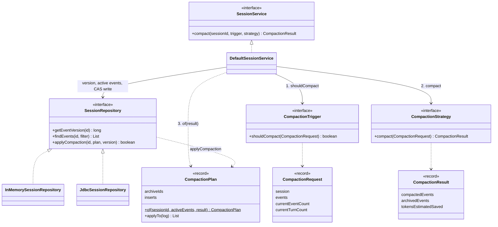
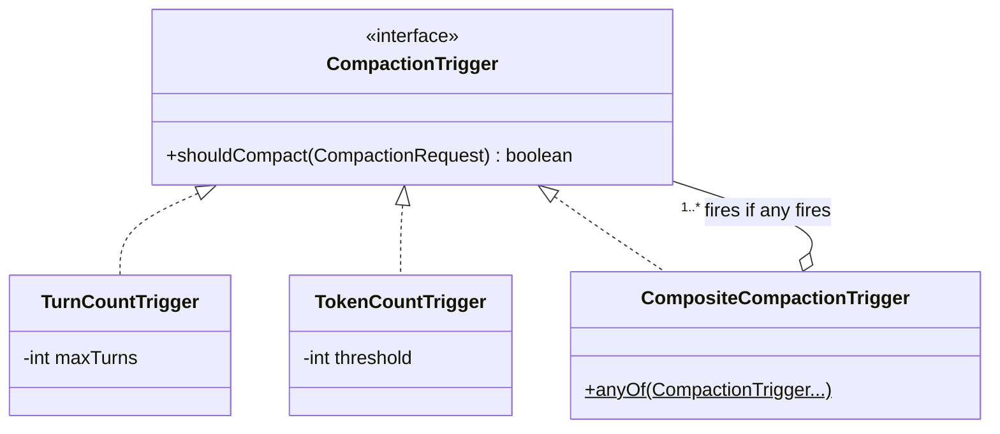
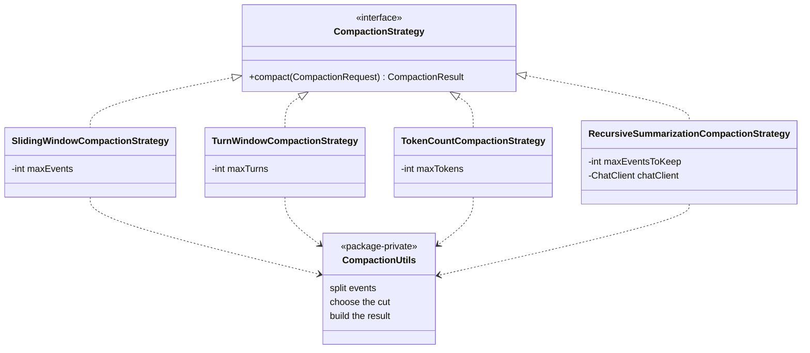
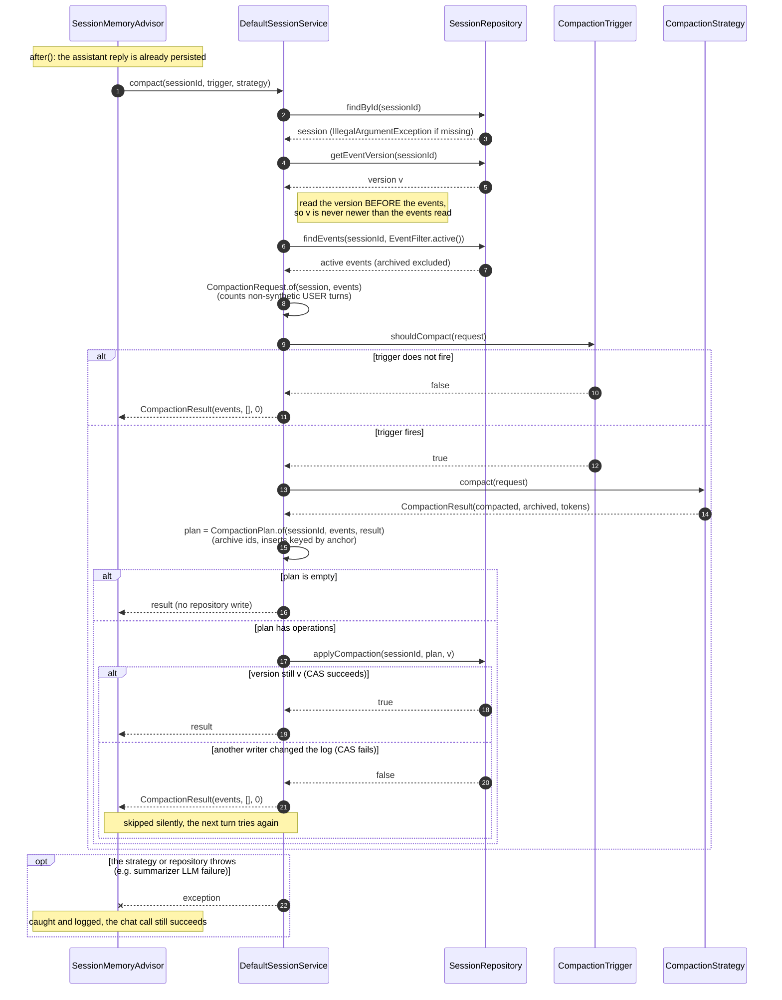
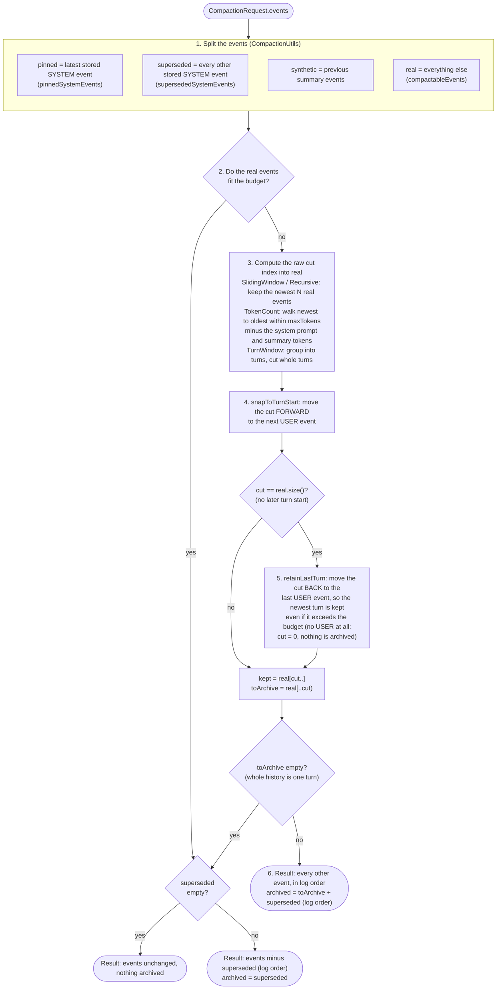
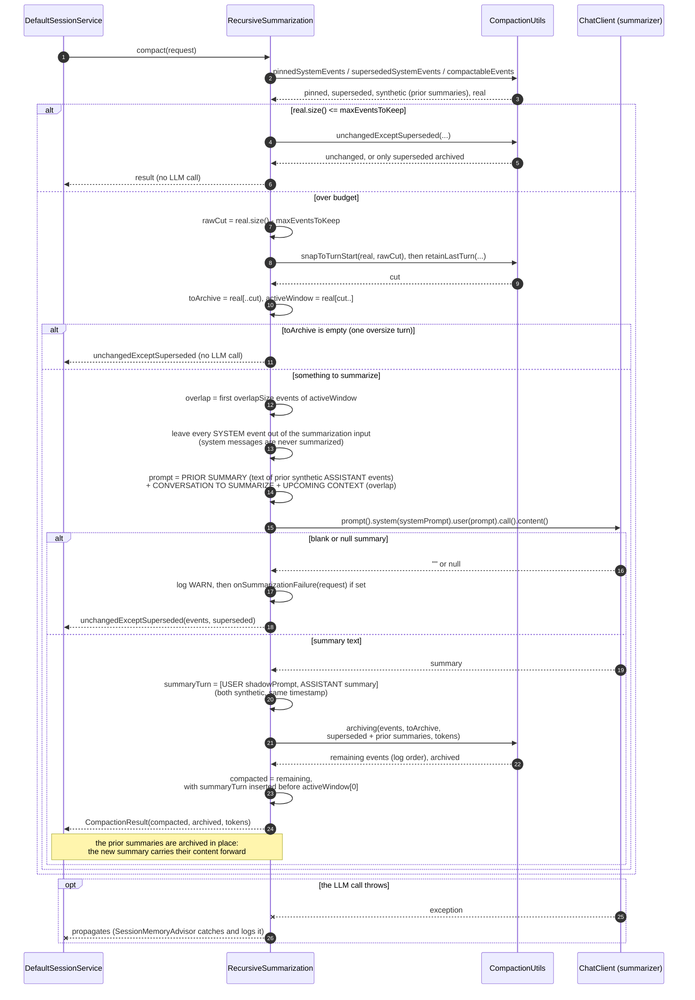
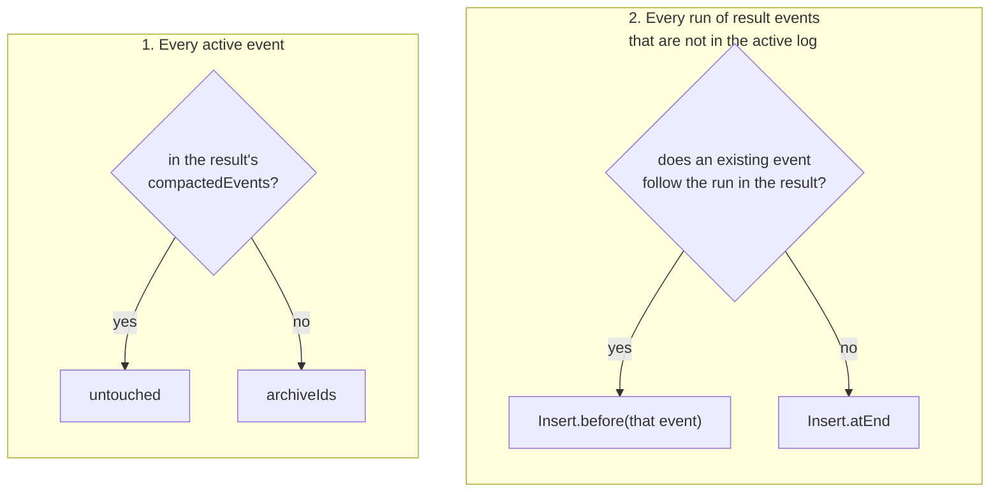
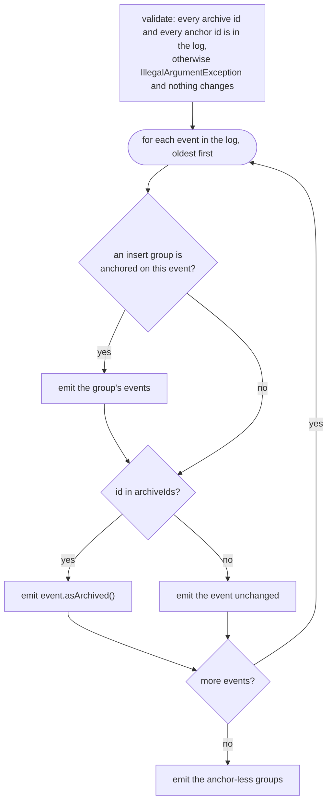
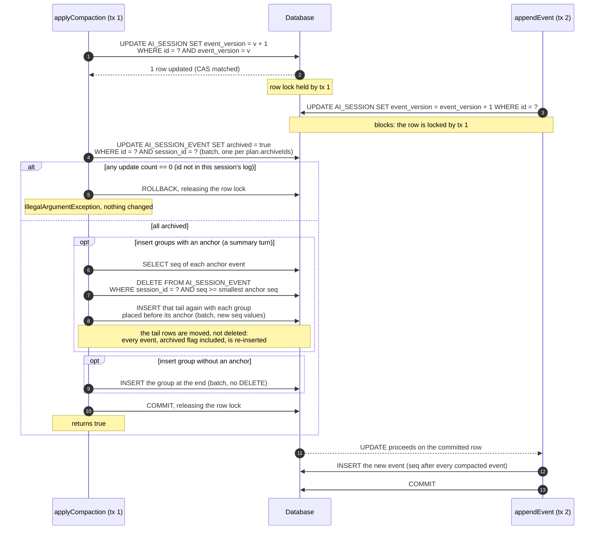

# How Compaction Works

This page explains what happens when a compaction pass runs, with diagrams and worked
examples. For choosing and configuring triggers and strategies, see
[Context Compaction](compaction.md).

| Section | Answers |
|---|---|
| [1. Class diagrams](#1-class-diagrams) | Which types take part, and what each contributes |
| [2. A compaction pass](#2-sequence-a-compaction-pass-end-to-end) | What the service, the strategy and the repository do, in order, and how the version check keeps concurrent writers apart |
| [3. What gets archived](#3-activity-how-a-strategy-chooses-what-to-archive) | How a strategy turns its budget into a cut that never splits a turn |
| [4. Summarization](#4-sequence-recursivesummarizationcompactionstrategy) | What the LLM is given, where the summary lands, what happens on a blank answer |
| [5. The plan](#5-compactionplan-from-result-to-write) | How a strategy result becomes archive flags and anchored inserts, and why an insert needs an anchor |
| [6. JDBC and a concurrent append](#6-sequence-jdbc-applycompaction-and-a-concurrent-append) | How the row lock orders a compaction against an append, and which rows are rewritten |
| [7. Tricky cases](#7-worked-examples-of-the-tricky-cases) | Seven inputs and their outputs: mid-turn cuts, oversize turns, updated system prompts, a prior summary |

One word is used precisely throughout: an event is **archived** when compaction flags it
and it stays in the log (searchable through Recall Storage). Compaction never deletes an
event; only deleting or expiring the whole session does.

!!! note "Implementation details"
    This page describes the current implementation. Package-private helpers such as
    `CompactionUtils` and the exact SQL used by `JdbcSessionRepository` are not public API
    and may change between releases. The public contract is `CompactionTrigger`,
    `CompactionStrategy`, `CompactionRequest`, `CompactionResult`,
    `SessionService.compact(...)`, `CompactionPlan` and
    `SessionRepository.applyCompaction(...)`.

---

## 1. Class diagrams

### 1a. Core contract

The **trigger** decides *whether* to compact, the **strategy** decides *what* to keep, and
the **repository** applies the result atomically. `DefaultSessionService.compact(...)`
connects them. Any caller can invoke it: `SessionMemoryAdvisor`, or your own code.


```mermaid
classDiagram
    direction TB

    class SessionService {
        <<interface>>
        +compact(sessionId, trigger, strategy) CompactionResult
    }
    class DefaultSessionService
    class SessionRepository {
        <<interface>>
        +getEventVersion(id) long
        +findEvents(id, filter) List
        +applyCompaction(id, plan, version) boolean
    }
    class InMemorySessionRepository
    class JdbcSessionRepository

    class CompactionTrigger {
        <<interface>>
        +shouldCompact(CompactionRequest) boolean
    }
    class CompactionStrategy {
        <<interface>>
        +compact(CompactionRequest) CompactionResult
    }
    class CompactionRequest {
        <<record>>
        session
        events
        currentEventCount
        currentTurnCount
    }
    class CompactionResult {
        <<record>>
        compactedEvents
        archivedEvents
        tokensEstimatedSaved
    }
    class CompactionPlan {
        <<record>>
        archiveIds
        inserts
        +of(sessionId, activeEvents, result)$ CompactionPlan
        +applyTo(log) List
    }

    SessionService <|.. DefaultSessionService
    DefaultSessionService --> SessionRepository : version, active events, CAS write
    SessionRepository <|.. InMemorySessionRepository
    SessionRepository <|.. JdbcSessionRepository
    DefaultSessionService --> CompactionTrigger : 1. shouldCompact
    DefaultSessionService --> CompactionStrategy : 2. compact
    DefaultSessionService ..> CompactionPlan : 3. of(result)
    CompactionTrigger ..> CompactionRequest
    CompactionStrategy ..> CompactionResult
    SessionRepository ..> CompactionPlan : applyCompaction
```

- **Triggers are cheap; strategies can be expensive.** The service always runs the trigger
  first, and only calls the strategy when it fires. That matters most for
  `RecursiveSummarizationCompactionStrategy`, which calls an LLM.
- **Strategies are pure.** They take a `CompactionRequest` (the session plus its *active*
  events) and return a `CompactionResult`. They never touch the repository; the service
  writes the result.
- **`CompactionResult` has two lists.** `compactedEvents` is the new active window.
  `archivedEvents` are the events to archive: they stay in the log and remain searchable
  through Recall Storage. Every active event not in `compactedEvents` is archived, whether
  or not the strategy listed it.
- **The service turns the result into a `CompactionPlan`.** The repository applies the
  plan without interpreting the result. §5 explains how the plan is derived and applied.

### 1b. Triggers


```mermaid
classDiagram
    direction TB

    class CompactionTrigger {
        <<interface>>
        +shouldCompact(CompactionRequest) boolean
    }
    class TurnCountTrigger {
        -int maxTurns
    }
    class TokenCountTrigger {
        -int threshold
    }
    class CompositeCompactionTrigger {
        +anyOf(CompactionTrigger...)$
    }

    CompactionTrigger <|.. TurnCountTrigger
    CompactionTrigger <|.. TokenCountTrigger
    CompactionTrigger <|.. CompositeCompactionTrigger
    CompositeCompactionTrigger o-- "1..*" CompactionTrigger : fires if any fires
```

| Trigger | Fires when | Settings |
|---|---|---|
| `TurnCountTrigger` | more than `maxTurns` turns (non-synthetic `USER` events) | `maxTurns` (constructor) |
| `TokenCountTrigger` | estimated tokens `>=` `threshold`, counted like the strategy's [budget](compaction.md#how-the-budget-is-spent) | `threshold` (required), `tokenCountEstimator` (default JTokkit) |
| `CompositeCompactionTrigger` | any of its triggers fires | `anyOf(...)` |

### 1c. Strategies


```mermaid
classDiagram
    direction TB

    class CompactionStrategy {
        <<interface>>
        +compact(CompactionRequest) CompactionResult
    }
    class SlidingWindowCompactionStrategy {
        -int maxEvents
    }
    class TurnWindowCompactionStrategy {
        -int maxTurns
    }
    class TokenCountCompactionStrategy {
        -int maxTokens
    }
    class RecursiveSummarizationCompactionStrategy {
        -int maxEventsToKeep
        -ChatClient chatClient
    }
    class CompactionUtils {
        <<package-private>>
        split events
        choose the cut
        build the result
    }

    CompactionStrategy <|.. SlidingWindowCompactionStrategy
    CompactionStrategy <|.. TurnWindowCompactionStrategy
    CompactionStrategy <|.. TokenCountCompactionStrategy
    CompactionStrategy <|.. RecursiveSummarizationCompactionStrategy
    SlidingWindowCompactionStrategy ..> CompactionUtils
    TurnWindowCompactionStrategy ..> CompactionUtils
    TokenCountCompactionStrategy ..> CompactionUtils
    RecursiveSummarizationCompactionStrategy ..> CompactionUtils
```

| Strategy | Keeps | Settings (defaults) |
|---|---|---|
| `SlidingWindowCompactionStrategy` | the newest `maxEvents` real events, cut at a turn boundary | `maxEvents` (20), `tokenCountEstimator` (JTokkit) |
| `TurnWindowCompactionStrategy` | the newest `maxTurns` complete turns | `maxTurns` (10), `tokenCountEstimator` (JTokkit) |
| `TokenCountCompactionStrategy` | a contiguous suffix of real events within `maxTokens`, cut at a turn boundary | `maxTokens` (4000), `tokenCountEstimator` (JTokkit) |
| `RecursiveSummarizationCompactionStrategy` | the newest `maxEventsToKeep` real events, plus an LLM summary of the rest | `chatClient` (required), `maxEventsToKeep` (10), `overlapSize` (2), `systemPrompt`, `shadowPrompt` (`DEFAULT_SUMMARY_SHADOW_PROMPT`), `eventFormatter`, `onSummarizationFailure`, `tokenCountEstimator` (JTokkit) |

All four share the helpers in `CompactionUtils`:

- **Split the events:** `pinnedSystemEvents` (the latest stored system message),
  `supersededSystemEvents` and `compactableEvents`.
- **Choose the cut:** `snapToTurnStart` and `retainLastTurn`. `TurnWindowCompactionStrategy`
  only uses `isTurnStart`: it groups events into whole turns, so it needs no snapping.
- **Build the result:** `unchangedExceptSuperseded` and `archiving`.

How these fit together is shown in [section 3](#3-activity-how-a-strategy-chooses-what-to-archive).

---

## 2. Sequence: a compaction pass, end to end

This covers what happens after a turn when compaction is configured on the advisor,
including the two "nothing happens" paths and the lost-race path.


```mermaid
sequenceDiagram
    autonumber
    participant Adv as SessionMemoryAdvisor
    participant Svc as DefaultSessionService
    participant Repo as SessionRepository
    participant Trg as CompactionTrigger
    participant Str as CompactionStrategy

    Note over Adv: after(): the assistant reply is already persisted
    Adv->>Svc: compact(sessionId, trigger, strategy)
    Svc->>Repo: findById(sessionId)
    Repo-->>Svc: session (IllegalArgumentException if missing)
    Svc->>Repo: getEventVersion(sessionId)
    Repo-->>Svc: version v
    Note right of Svc: read the version BEFORE the events,<br/>so v is never newer than the events read
    Svc->>Repo: findEvents(sessionId, EventFilter.active())
    Repo-->>Svc: active events (archived excluded)
    Svc->>Svc: CompactionRequest.of(session, events)<br/>(counts non-synthetic USER turns)
    Svc->>Trg: shouldCompact(request)
    alt trigger does not fire
        Trg-->>Svc: false
        Svc-->>Adv: CompactionResult(events, [], 0)
    else trigger fires
        Trg-->>Svc: true
        Svc->>Str: compact(request)
        Str-->>Svc: CompactionResult(compacted, archived, tokens)
        Svc->>Svc: plan = CompactionPlan.of(sessionId, events, result)<br/>(archive ids, inserts keyed by anchor)
        alt plan is empty
            Svc-->>Adv: result (no repository write)
        else plan has operations
            Svc->>Repo: applyCompaction(sessionId, plan, v)
            alt version still v (CAS succeeds)
                Repo-->>Svc: true
                Svc-->>Adv: result
            else another writer changed the log (CAS fails)
                Repo-->>Svc: false
                Svc-->>Adv: CompactionResult(events, [], 0)
                Note over Svc,Adv: skipped silently, the next turn tries again
            end
        end
    end
    opt the strategy or repository throws (e.g. summarizer LLM failure)
        Svc--xAdv: exception
        Note over Adv: caught and logged, the chat call still succeeds
    end
```

**Why the version is read first.** If an append lands between `getEventVersion` and
`findEvents`, the strategy sees the new event but the CAS still expects the older
version, so the write is rejected. The service never writes a result computed from events
that are newer than the version it checks.

---

## 3. Activity: how a strategy chooses what to archive

All four strategies share this pipeline; its output is the `CompactionResult` that the
service turns into a `CompactionPlan` (see §2). They differ in step 3, how the raw cut is
computed, and in two more places:

- `TokenCountCompactionStrategy` has no step 2 shortcut: it always walks the events and
  computes a cut.
- `TurnWindowCompactionStrategy` cuts whole turns, so it skips steps 4 and 5. Events
  before its first `USER` event form a preamble that is always kept.


```mermaid
flowchart TB
    start([CompactionRequest.events]) --> split

    subgraph split["1. Split the events (CompactionUtils)"]
        direction TB
        s1["pinned = latest stored SYSTEM event<br/>(pinnedSystemEvents)"]
        s2["superseded = every other stored SYSTEM event<br/>(supersededSystemEvents)"]
        s3["synthetic = previous summary events"]
        s4["real = everything else<br/>(compactableEvents)"]
    end

    split --> budget{"2. Do the real events<br/>fit the budget?"}
    budget -- yes --> noop{"superseded<br/>empty?"}
    noop -- yes --> r0([Result: events unchanged, nothing archived])
    noop -- no --> r1(["Result: events minus superseded (log order)<br/>archived = superseded"])

    budget -- no --> raw["3. Compute the raw cut index into real<br/>SlidingWindow / Recursive: keep the newest N real events<br/>TokenCount: walk newest to oldest within maxTokens<br/>minus the system prompt and summary tokens<br/>TurnWindow: group into turns, cut whole turns"]
    raw --> snap["4. snapToTurnStart: move the cut FORWARD<br/>to the next USER event"]
    snap --> end1{"cut == real.size()?<br/>(no later turn start)"}
    end1 -- no --> cut
    end1 -- yes --> retain["5. retainLastTurn: move the cut BACK to the<br/>last USER event, so the newest turn is kept<br/>even if it exceeds the budget (no USER at all:<br/>cut = 0, nothing is archived)"]
    retain --> cut["kept = real[cut..]<br/>toArchive = real[..cut)"]
    cut --> empty{"toArchive empty?<br/>(whole history is one turn)"}
    empty -- yes --> noop
    empty -- no --> r2(["6. Result: every other event, in log order<br/>archived = toArchive + superseded (log order)"])
```

**Invariants the pipeline guarantees:**

- **The kept window always starts at a `USER` event,** apart from
  `TurnWindowCompactionStrategy`'s preamble. No kept assistant reply or tool result loses
  the user message that started its turn.
- **The newest turn is never archived.** Step 5 keeps it even when it alone exceeds the
  budget.
- **At most one stored system message stays active,** and it is never
  summarized. Superseded ones are archived on every pass, even when no cut is needed or
  the summarizer returned a blank summary.
- **Synthetic summaries survive** the sliding-window, turn-window and token-count
  strategies. The recursive strategy replaces them (see section 4).

---

## 4. Sequence: RecursiveSummarizationCompactionStrategy

The most complicated strategy: it calls an LLM, folds earlier summaries into the new one,
and has to keep system messages out of the summary.


```mermaid
sequenceDiagram
    autonumber
    participant Caller as DefaultSessionService
    participant R as RecursiveSummarization
    participant U as CompactionUtils
    participant LLM as ChatClient (summarizer)

    Caller->>R: compact(request)
    R->>U: pinnedSystemEvents / supersededSystemEvents / compactableEvents
    U-->>R: pinned, superseded, synthetic (prior summaries), real
    alt real.size() <= maxEventsToKeep
        R->>U: unchangedExceptSuperseded(...)
        U-->>R: unchanged, or only superseded archived
        R-->>Caller: result (no LLM call)
    else over budget
        R->>R: rawCut = real.size() - maxEventsToKeep
        R->>U: snapToTurnStart(real, rawCut), then retainLastTurn(...)
        U-->>R: cut
        R->>R: toArchive = real[..cut), activeWindow = real[cut..]
        alt toArchive is empty (one oversize turn)
            R-->>Caller: unchangedExceptSuperseded (no LLM call)
        else something to summarize
            R->>R: overlap = first overlapSize events of activeWindow
            R->>R: leave every SYSTEM event out of the summarization input<br/>(system messages are never summarized)
            R->>R: prompt = PRIOR SUMMARY (text of prior synthetic ASSISTANT events)<br/>+ CONVERSATION TO SUMMARIZE + UPCOMING CONTEXT (overlap)
            R->>LLM: prompt().system(systemPrompt).user(prompt).call().content()
            alt blank or null summary
                LLM-->>R: "" or null
                R->>R: log WARN, then onSummarizationFailure(request) if set
                R-->>Caller: unchangedExceptSuperseded(events, superseded)
            else summary text
                LLM-->>R: summary
                R->>R: summaryTurn = [USER shadowPrompt, ASSISTANT summary]<br/>(both synthetic, same timestamp)
                R->>U: archiving(events, toArchive,<br/>superseded + prior summaries, tokens)
                U-->>R: remaining events (log order), archived
                R->>R: compacted = remaining,<br/>with summaryTurn inserted before activeWindow[0]
                R-->>Caller: CompactionResult(compacted, archived, tokens)
                Note over R,Caller: the prior summaries are archived in place:<br/>the new summary carries their content forward
            end
        end
    end
    opt the LLM call throws
        LLM--xR: exception
        R--xCaller: propagates (SessionMemoryAdvisor catches and logs it)
    end
```

**What makes it "recursive".** Each pass feeds the previous summary's text back to the
LLM as `=== PRIOR SUMMARY ===`. The new summary therefore builds on the old one, and the
old synthetic events are archived in place like the events they summarized. The resulting active window holds
the latest stored system message (if any, where it was stored), one summary turn right
before the kept conversation, and the recent real events, all in log order.

**Why the summary is a user + assistant pair.** Many providers require the messages after
the system prompt to alternate user and assistant. The shadow-prompt user message plus
the assistant summary, followed by a kept window that starts with a user message, keep
that alternation valid; a lone assistant summary would not.

---

## 5. CompactionPlan: from result to write

A strategy answers one question: what should the active window look like now? A
repository needs a different one: which rows do I touch? `CompactionPlan` is the
translation between the two. `DefaultSessionService` derives it from the active log the
strategy saw and the strategy's result, and passes it to `applyCompaction` (§2, step 3).
The plan has two parts:

- `archiveIds`: the existing events to flag archived, in place;
- `inserts`: groups of new events, each with the id of the existing event it goes in
  front of (`Insert.before`), or with no anchor when it goes at the end (`Insert.atEnd`).

Nothing else is expressible: an existing event can only stay or be archived, never move or
disappear.

### 5a. Deriving the plan: `CompactionPlan.of(sessionId, activeEvents, result)`


```mermaid
flowchart LR
    subgraph existing["1. Every active event"]
        direction TB
        e1{"in the result's<br/>compactedEvents?"}
        e1 -- yes --> e2["untouched"]
        e1 -- no --> e3["archiveIds"]
    end
    subgraph fresh["2. Every run of result events<br/>that are not in the active log"]
        direction TB
        n1{"does an existing event<br/>follow the run in the result?"}
        n1 -- yes --> n2["Insert.before(that event)"]
        n1 -- no --> n3["Insert.atEnd"]
    end
    existing ~~~ fresh
```

- **Archive everything the result does not keep.** This includes what the strategy listed
  in `archivedEvents` and anything else it left out, such as the summary a recursive pass
  replaces. The two are the same set for the built-in strategies; the rule just does not
  depend on it.
- **New events are anchored on what follows them.** Compaction never reorders the log, and
  since #56 the log order is the prompt order, so a new summary turn has to be *placed*,
  not appended. The result already says where: the first existing event after it. A run of
  new events at the very end of the result has nothing to anchor on and is appended.
- **New events must belong to the session.** A result that contains an event of another
  session is rejected with `IllegalArgumentException` before anything is written.

### 5b. Applying the plan: `CompactionPlan.applyTo(log)`

The reference implementation walks the log once. `InMemorySessionRepository` calls it
directly; `JdbcSessionRepository` implements the same rules in SQL (§6).


```mermaid
flowchart TD
    v["validate: every archive id and every anchor id is in the log,<br/>otherwise IllegalArgumentException and nothing changes"]
    v --> each([for each event in the log, oldest first])
    each --> g{"an insert group is<br/>anchored on this event?"}
    g -- yes --> emit["emit the group's events"] --> a
    g -- no --> a{"id in archiveIds?"}
    a -- yes --> flag["emit event.asArchived()"] --> more
    a -- no --> keep["emit the event unchanged"] --> more
    more{"more events?"} -- yes --> each
    more -- no --> tail["emit the anchor-less groups"]
```

### 5c. Worked example

A recursive pass with `maxEventsToKeep = 2` on a log that already holds a summary
(`Σold`) from an earlier pass, in front of the turns that were appended after it. `*`
marks the archived flag.

```
active log      Σold  U1  A1  U2  A2  U3  A3
result          compactedEvents = [Σnew U3 A3]    archivedEvents = [Σold U1 A1 U2 A2]

plan            archiveIds = {Σold U1 A1 U2 A2}   active, not in compactedEvents
                inserts    = [Σnew before U3]     new, followed by the existing U3

applyTo         Σold* U1* A1* U2* A2* Σnew U3 A3
active view                          Σnew U3 A3
```

Every existing event keeps its position. `Σold` stays where it was, flagged, so the log
still shows what the model was told before this pass and Recall Storage can still find it.
The new turn lands in front of `U3` because that is where the prompt needs it; an
append-only write would have put the summary *after* the events it summarizes.

---

## 6. Sequence: JDBC `applyCompaction` and a concurrent append

On JDBC the CAS is a row-level lock on the session row. Both writers take that lock
*before* touching events. An append must also lock the row before it inserts; otherwise
its event could be ordered before the part of the log that compaction re-inserts.


```mermaid
sequenceDiagram
    autonumber
    participant C as applyCompaction (tx 1)
    participant DB as Database
    participant A as appendEvent (tx 2)

    C->>DB: UPDATE AI_SESSION SET event_version = v + 1<br/>WHERE id = ? AND event_version = v
    DB-->>C: 1 row updated (CAS matched)
    Note over DB: row lock held by tx 1
    A->>DB: UPDATE AI_SESSION SET event_version = event_version + 1 WHERE id = ?
    Note over A,DB: blocks: the row is locked by tx 1
    C->>DB: UPDATE AI_SESSION_EVENT SET archived = true<br/>WHERE id = ? AND session_id = ? (batch, one per plan.archiveIds)
    alt any update count == 0 (id not in this session's log)
        C->>DB: ROLLBACK, releasing the row lock
        Note over C: IllegalArgumentException, nothing changed
    else all archived
        opt insert groups with an anchor (a summary turn)
            C->>DB: SELECT seq of each anchor event
            C->>DB: DELETE FROM AI_SESSION_EVENT<br/>WHERE session_id = ? AND seq >= smallest anchor seq
            C->>DB: INSERT that tail again with each group<br/>placed before its anchor (batch, new seq values)
            Note over C,DB: the tail rows are moved, not deleted:<br/>every event, archived flag included, is re-inserted
        end
        opt insert group without an anchor
            C->>DB: INSERT the group at the end (batch, no DELETE)
        end
        C->>DB: COMMIT, releasing the row lock
        Note over C: returns true
    end
    DB-->>A: UPDATE proceeds on the committed row
    A->>DB: INSERT the new event (seq after every compacted event)
    A->>DB: COMMIT
```

**The two orderings:**

- **Compaction locks first** (as drawn): the append waits, then inserts with a higher
  `seq`, so it is ordered after every compacted event. It also bumps the version again,
  and the next compaction sees the new event.
- **Append locks first:** compaction's CAS `UPDATE` waits. When the append commits, the
  version is `v + 1`, the CAS matches 0 rows, and `applyCompaction` returns `false`. The
  service skips silently, and the next turn compacts from fresh events.

**In-memory equivalent:** `InMemorySessionRepository` does the same inside a single
`ConcurrentHashMap.compute`. It checks the version, calls `CompactionPlan.applyTo(log)`
(§5b), and bumps the version.

---

## 7. Worked examples of the tricky cases

Each example gives the active events before compaction and the resulting
`compactedEvents` / `archivedEvents`. `S:` is a stored system message, `U`/`A` are user
and assistant messages, and `Σ` is the synthetic summary turn.

| # | Case | Before (active) | Strategy | Kept (active after) | Archived |
|---|---|---|---|---|---|
| 1 | Cut lands mid-turn | `U1 A1 U2 A2a A2b U3 A3` | SlidingWindow, `maxEvents = 3` | `U3 A3` | `U1 A1 U2 A2a A2b` |
| 2 | Newest turn alone is over budget | `U1 A1 U2 A2 A3 A4` | SlidingWindow, `maxEvents = 2` | `U2 A2 A3 A4` | `U1 A1` |
| 3 | Whole history is one oversize turn | `U1 A1 A2 A3` | SlidingWindow, `maxEvents = 2` | unchanged | nothing |
| 4 | System message updated mid-session | `S:v1 U1 A1 S:v2 U2 A2` | SlidingWindow, `maxEvents = 20` | `U1 A1 S:v2 U2 A2` | `S:v1` |
| 5 | System prompt stored in an old turn | `U1 S A1 U2 A2 U3 A3` | SlidingWindow, `maxEvents = 2` | `S U3 A3` | `U1 A1 U2 A2` |
| 6 | Token budget with a system prompt | `S:sys(11) U(8) A(13) U(8) A(13)` | TokenCount, `maxTokens = 45` | `S:sys U A` (newest turn) | the older turn |
| 7 | Recursive with a prior summary | `Σold U1 A1 U2 A2 U3 A3` | Recursive, `maxEventsToKeep = 2`, `overlapSize = 1` | `Σnew U3 A3` | `Σold U1 A1 U2 A2` |

**Notes on the examples:**

1. The raw cut lands inside turn 2. The forward snap moves it to `U3`, so turn 2 is
   archived whole instead of being split.
2. The raw cut lands inside the last turn, and snapping forward finds no later turn.
   `retainLastTurn` keeps turn 2 even though it exceeds `maxEvents`.
3. Snapping and retaining leave nothing to archive, so the pass is a no-op.
4. The budget needs no cut, but the superseded `S:v1` is still archived. `S:v2` stays
   where it was stored; the advisor puts it first in the prompt.
5. The system prompt was stored in turn 1. Turn 1 is archived, but the latest stored
   system message stays active where it was stored, so later turns still have it.
6. The system prompt's 11 tokens come off the budget first, leaving 34. Only the newest
   turn fits, so the older turn is archived. Without the system prompt both turns (42)
   would fit in 45.
7. The LLM receives `Σold`'s text as the prior summary plus `U1 A1 U2 A2` (and the overlap
   `U3`). `Σold` is archived in place like the turns it summarized; its content lives on
   in `Σnew`. §5c shows the same case as a plan.

---

## See also

- [Context Compaction](compaction.md): triggers, strategies and how to configure them
- [System Messages](system-messages.md): why stored system messages are treated as
  configuration, and the "latest wins" rule
- [Session JDBC](../session-jdbc/index.md): the JDBC repository, schema and design notes
- [Multi-Agent](multi-agent.md): a session per sub-agent
