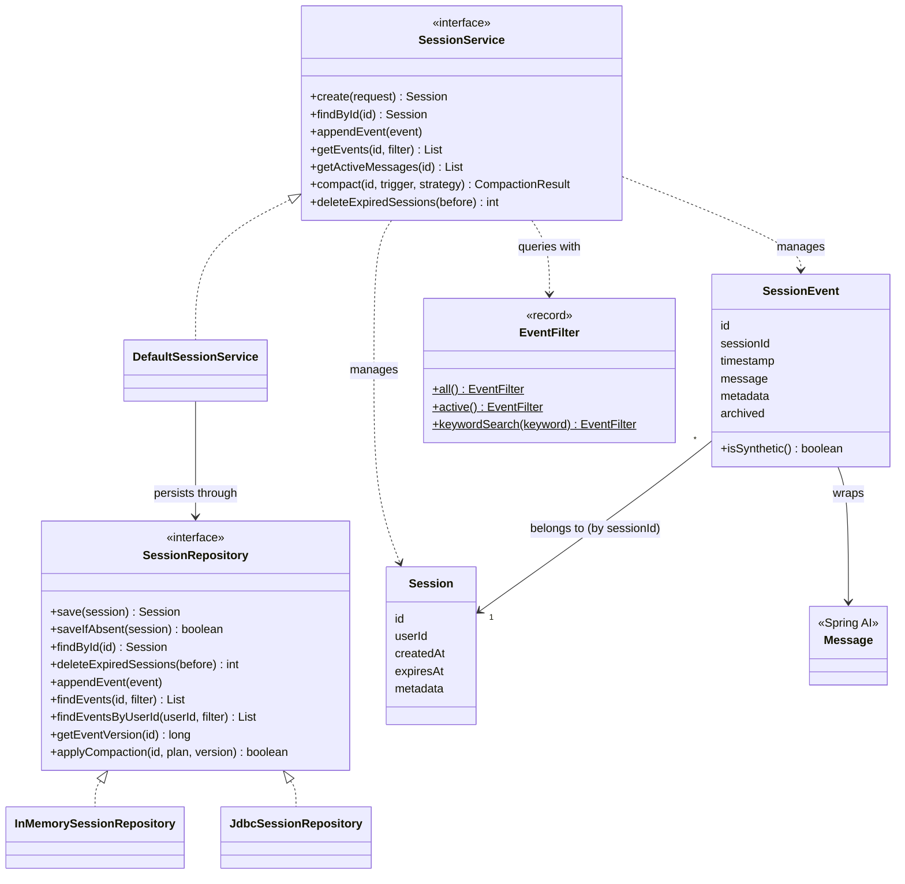
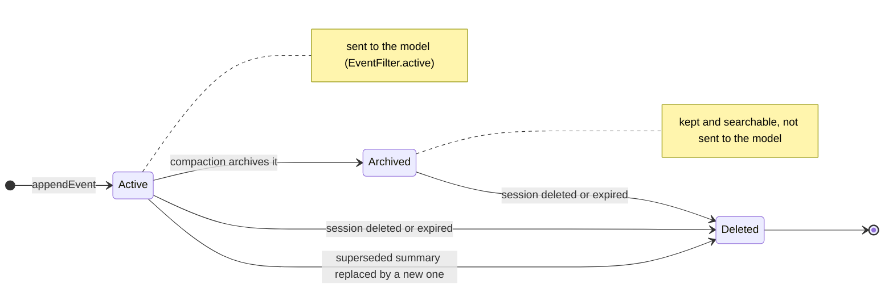
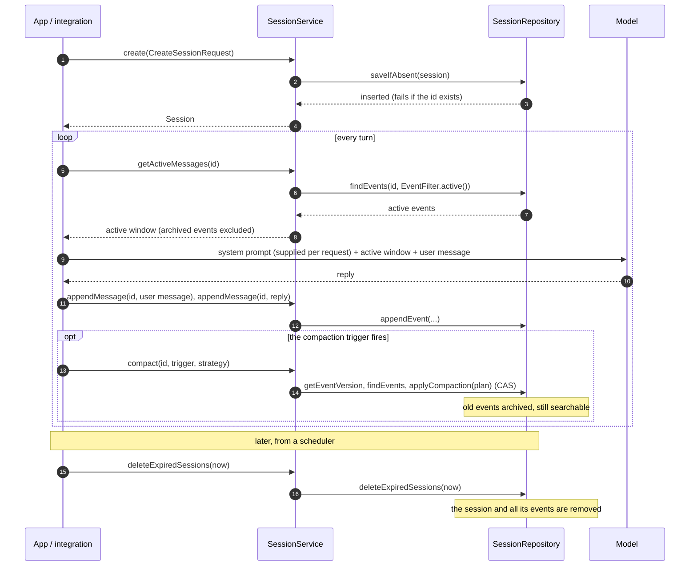

# Session Concepts

Spring AI Session introduces four closely related concepts that together describe how a
conversation is stored, structured, and managed over time.

---

## Session

`Session` is the **identity and lifecycle container** for a single, continuous conversation
between a user and an agent. It is an immutable value object — it holds only metadata.
The event log is stored separately in the repository and fetched on demand.

| Field | Description |
|-------|-------------|
| `id` | Unique session identifier |
| `userId` | Owning user or agent — required, used for isolation |
| `createdAt` | Creation timestamp |
| `expiresAt` | Expiry instant. Sessions created through `SessionService.create` always get one: the request's `timeToLive`, or the service's default (60 days, configurable). `null` (no expiry) is only possible for a `Session` built directly with `Session.builder().expiresAt(null)`. |
| `metadata` | Arbitrary key/value pairs (model info, tags, etc.) |

Keeping `Session` metadata-only means it can be passed across boundaries cheaply and stays
immutable: every event mutation goes through dedicated repository methods (`appendEvent`,
`applyCompaction`), and compaction strategies receive the event list as an explicit
parameter.

Sessions are created through `SessionService`, which is the primary API for the entire
lifecycle:

```java
SessionService service = DefaultSessionService.builder()
    .sessionRepository(InMemorySessionRepository.builder().build())
    .build();

Session session = service.create(
    CreateSessionRequest.builder()
        .id("my-session-id")           // optional; a UUID is generated when omitted
        .userId("alice")
        .timeToLive(Duration.ofHours(2)) // optional; defaults to 60 days
        .metadata("agentType", "research-assistant")
        .build()
);
```

---

## SessionEvent

`SessionEvent` is an immutable value object that wraps a Spring AI `Message` type. It adds only
what `Message` intentionally omits: identity, ownership, ordering, and framework flags.

| Field | Description |
|-------|-------------|
| `id` | Unique identity per event (UUID by default) |
| `sessionId` | Ownership / isolation |
| `timestamp` | Chronological ordering (`Instant.now()` by default) |
| `message` | The Spring AI message — no duplication of content |
| `metadata` | Framework flags such as `METADATA_SYNTHETIC` and `METADATA_COMPACTION_SOURCE` |
| `archived` | `true` once compaction has moved the event out of the active window; it stays in the log and remains searchable (see [Event lifecycle](#event-lifecycle)) |

### Message types

| Message type | `SessionEvent.isSynthetic()` | Meaning | Compaction |
|---|---|---|---|
| `UserMessage` | `false` | Real user input. It starts a [turn](#turn) | Archived with its turn |
| `AssistantMessage` (no tool calls) | `false` | Agent response | Archived with its turn |
| `AssistantMessage` (with tool calls) | `false` | Agent tool invocation | Archived with its turn, never separated from its tool results |
| `ToolResponseMessage` | `false` | Tool output | Archived with its turn |
| `SystemMessage` | `false` | A stored system prompt: configuration, not conversation. Storing one is opt-in | The latest one is kept; earlier ones are archived. Never summarized. See [System Messages](system-messages.md#compaction-the-latest-stored-system-message-wins) |
| `UserMessage` | `true` | Synthetic shadow prompt opening a summary turn | Kept by the sliding-window, turn-window and token-count strategies. Replaced (deleted) by the next recursive summary |
| `AssistantMessage` | `true` | Synthetic summary text closing a summary turn | As above. Its text is fed to the next recursive summary as the prior summary |
| `SystemMessage` | `true` | Legacy summary format from earlier versions | As above. Still read as a prior summary by the recursive strategy |

With `RecursiveSummarizationCompactionStrategy`, real events other than system messages
are summarized before they are archived.

### Building events

```java
// Timestamped at Instant.now()
SessionEvent event = SessionEvent.builder()
    .sessionId(sessionId)
    .message(new UserMessage("Hello"))
    .build();

// With metadata
SessionEvent custom = SessionEvent.builder()
    .sessionId(sessionId)
    .message(new AssistantMessage("Response"))
    .metadata("model", "gpt-4o")
    .metadata("latencyMs", 230)
    .build();

// Deterministic timestamp (useful for tests)
SessionEvent deterministic = SessionEvent.builder()
    .sessionId(sessionId)
    .timestamp(Instant.parse("2025-06-01T12:00:00Z"))
    .message(new UserMessage("Hello"))
    .build();
```

Builder defaults: `id` is a random UUID, `timestamp` is `Instant.now()`, `metadata` is
empty. Only `sessionId` and `message` are required.

---

## Turn

A **turn** is the atomic unit of conversation:

> One `UserMessage` plus all subsequent events (assistant replies, tool calls, tool
> results) up to the next `UserMessage`.

Working with turns rather than raw message counts prevents compaction from splitting a
tool-call/result pair, or from removing an assistant reply while keeping the user question
that prompted it.

```
Turn 1: [USER "What is Spring AI?"]  [ASSISTANT "Spring AI is..."]
Turn 2: [USER "Can it use tools?"]   [ASSISTANT (tool call)]  [TOOL result]  [ASSISTANT "Yes, ..."]
Turn 3: [USER "Show me an example"]  [ASSISTANT "Here is..."]
```

Turn count is measured via `CompactionRequest.currentTurnCount()`, which counts the
non-synthetic `USER` events. The shadow prompt of a synthetic summary turn is excluded, so
it does not inflate the count used by `TurnCountTrigger`.

---

## Synthetic Summary Turn

When `RecursiveSummarizationCompactionStrategy` compacts a session it replaces archived
events with two synthetic events that form a coherent conversation turn:

```
[USER  / synthetic] "Summarize the conversation we had so far."
[ASST  / synthetic] "The user asked about topic X. The assistant explained..."
[USER  / real     ] "Next actual question"
[ASST  / real     ] "Next actual response"
```

This mirrors the OpenAI Agents SDK shadow-prompt pattern and ensures that downstream
models always see a valid user↔assistant alternation.

All compaction strategies set synthetic events and stored system messages aside before
processing real events (for system messages, see
[System Messages](system-messages.md#compaction-the-latest-stored-system-message-wins)).
The sliding-window, turn-window and token-count strategies keep synthetic events unchanged,
where they are in the log. `RecursiveSummarizationCompactionStrategy` instead folds the previous
summary into the new one and **replaces** it: the superseded synthetic events are removed
from the log (they are not archived).

Build a synthetic summary turn explicitly:

```java
Instant now = Instant.now();
List<SessionEvent> summaryTurn = List.of(
    SessionEvent.builder()
        .sessionId(sessionId)
        .timestamp(now)
        .message(new UserMessage("Summarize the conversation we had so far."))
        .metadata(SessionEvent.METADATA_SYNTHETIC, true)
        .metadata(SessionEvent.METADATA_COMPACTION_SOURCE, "recursive-summarization")
        .build(),
    SessionEvent.builder()
        .sessionId(sessionId)
        .timestamp(now)
        .message(new AssistantMessage("The user asked about X. The assistant..."))
        .metadata(SessionEvent.METADATA_SYNTHETIC, true)
        .metadata(SessionEvent.METADATA_COMPACTION_SOURCE, "recursive-summarization")
        .build()
);
```

Both events share the same `Instant` so the user/assistant pair is treated as an atomic
unit.

---

## Architecture Overview

The core model and API. Compaction types are covered separately in
[Compaction Internals](compaction-internals.md#1-class-diagrams).



### Event lifecycle

An event is appended once and never edited. Its content never changes; only its state
does:



- **Active:** part of the active context window. Appending an event with an id that
  already exists is an idempotent replay and changes nothing.
- **Archived:** compaction moved it out of the active window, for example an old turn, or
  a stored system message superseded by a newer one. The latest stored system message
  always stays active.
- **Deleted:** gone from the log. This only happens to a synthetic summary that a new
  summary replaces, or when its whole session is deleted (`delete`, or
  `deleteExpiredSessions` for expired sessions).

**Archiving instead of deleting**

Compaction marks the real events it removes from the active window as archived
(`SessionEvent.isArchived()`) via `applyCompaction`, so the full verbatim history stays in
the log. What an integration sends to the model is the `EventFilter.active()` view, while
[Recall Storage](../recall-memory/recall-storage.md) searches (`EventFilter.keywordSearch(...)`) span the
whole log, archived events included. This makes the MemGPT recall pattern work: the agent
can surface any prior exchange after it has been compacted out of context. Only a
superseded synthetic summary is deleted instead, because its content is carried into the
new summary.

In the JDBC repository, newly archived events are flagged with an in-place `UPDATE`.
Compaction never reorders the log: only when a summary is inserted is the part of the log
after it re-inserted, so the archived history before that point (normally all of it) is
never re-read or re-written.

### Optimistic concurrency

`SessionRepository.getEventVersion(sessionId)` is a monotonically increasing counter,
incremented on every `appendEvent` that appends a new event and on every successful
`applyCompaction` call. `DefaultSessionService.compact` reads it before fetching the
active events, turns the strategy's result into a `CompactionPlan` (which events to
archive, which to delete, which new events to insert before which existing event) and
passes both to `applyCompaction(sessionId, plan, expectedVersion)`. If another writer
changed the log in between, this compare-and-swap (CAS) returns `false`, and the caller
treats it as a no-op rather than retrying. Durable implementations should map it to a
database-level optimistic-lock column, as the JDBC repository does; a Redis
implementation, for example, would use `WATCH`.

### Idempotent appendEvent {#idempotent-appendevent}

A retried `appendEvent` call for an id that was already committed is a no-op, not an
error or a duplicate, and does not increment the event-log version.
`InMemorySessionRepository` checks the session's events for the id before appending.
`JdbcSessionRepository` inserts and treats a primary-key violation on the event `id` as a
replay.

In JDBC the event `id` is the primary key of the whole `AI_SESSION_EVENT` table, not just
of one session. Reusing an id that already belongs to a *different* session throws
`IllegalStateException` instead of being treated as a replay, so event ids should be
unique across sessions. The default id is a random UUID, so this only matters when a
caller supplies its own deterministic ids. See [`SessionMemoryAdvisor`'s pluggable id
generators](../chat-client/chat-client.md#idempotent-session-event-ids).

**Event ordering**

Events are returned in insertion (logical conversation) order, not by wall-clock
timestamp. The JDBC implementation persists a monotonic `seq` column for this purpose so
that a synthetic compaction summary — stamped with the compaction time — stays correctly
positioned ahead of the older active-window events it precedes.

### Implementing a `SessionRepository`

The contract follows one rule: **the backend owns selection, core owns interpretation.**
Filtering, paging and searching are the backend's job, because their cost grows with the
size of the log. What a compaction *means* (turn boundaries, ordering, what a summary
replaces) is decided in core and handed to the backend as plain write operations, so no
backend has to reimplement it. Core ships three helpers for this, and a test kit that
checks the whole contract.

**Reads push the filter down.** `findEvents(sessionId, filter)` must not read the whole
log for a `lastN` or a page. Evaluate `excludeArchived`, `excludeSynthetic`,
`messageTypes`, the time range, `lastN`, `page`/`pageSize` and, where the store can, the
keywords in the query itself. `EventFilter.apply(List)` is the reference implementation of
the read contract for a log held as a list; use it only for what the store cannot express,
as the JDBC repository does for `pattern` (a Java regex cannot be translated to portable
SQL). `findEventsByUserId(userId, filter)` has a default that loops over the user's
sessions and windows the union in memory; a store that can join sessions and events should
override it with one sorted, paged query.

**Messages have one persisted shape.** `SessionEventCodec` encodes a `Message` into its
type, text and a JSON `data` payload (tool calls or tool responses), and decodes it back.
Stores that keep columns or fields use it so every backend stores the same thing.

**Compaction is a plan.** `applyCompaction(sessionId, plan, expectedVersion)` receives a
`CompactionPlan` with three parts: `archiveIds` to flag archived in place, `deleteIds` to
remove (a superseded summary), and `inserts`, each a group of new events that goes
immediately before an existing anchor event, or at the end when the anchor is `null`.
Existing events never move. `CompactionPlan.applyTo(log)` is the reference merge for a log
held as a list; list-based stores can call it directly.

**Run the contract tests.** The `spring-ai-session-test` artifact contains
`AbstractSessionRepositoryContractTests`, the suite the built-in in-memory, H2, PostgreSQL
and MySQL repositories run. Subclass it and provide a repository:

```xml
<dependency>
    <groupId>org.springaicommunity</groupId>
    <artifactId>spring-ai-session-test</artifactId>
    <scope>test</scope>
</dependency>
```

```java
class MySessionRepositoryContractTests extends AbstractSessionRepositoryContractTests {

    @Override
    protected SessionRepository createRepository() {
        return new MySessionRepository(/* a fresh or emptied store */);
    }

}
```

It covers idempotent append, the version rules, `saveIfAbsent` under concurrent creates,
expiry cleanup, every filter criterion and window, and every compaction rule (archive in
place, delete, insert before an anchor, append, stale version, unknown ids).

---

## Session Lifecycle

A session from creation to cleanup, driven by any integration: your own agent loop, or
`SessionMemoryAdvisor`, which performs the per-turn steps automatically for `ChatClient`
(see [ChatClient Integration](../chat-client/chat-client.md)).



```java
// 1. Create (service built as in the Session section above)
Session session = service.create(
    CreateSessionRequest.builder()
        .userId("alice")
        .build()
);

// 2. Append events (shorthand wraps a Message in a SessionEvent automatically)
service.appendMessage(session.id(), new UserMessage("What is Spring AI?"));
service.appendMessage(session.id(), new AssistantMessage("Spring AI is..."));

// 3. Retrieve the active context window as a Message list (for passing to an LLM)
List<Message> history = service.getActiveMessages(session.id());

//    ...or the full recorded history, including events archived by compaction
List<Message> fullHistory = service.getMessages(session.id());

// 4. Retrieve as SessionEvent list (for filtering, inspection, compaction)
List<SessionEvent> events = service.getEvents(session.id());

// 5. Delete a single session
service.delete(session.id());

// 6. Delete all expired sessions (call from a scheduler)
int removed = service.deleteExpiredSessions(Instant.now());
```

Deleted sessions are removed from the repository entirely — there is no tombstone state.

### Expiry cleanup

Sessions are not automatically swept — `deleteExpiredSessions(Instant)` must be called
explicitly. Wire it to a scheduler in your application:

```java
@Scheduled(fixedRate = 3_600_000) // every hour
void sweepExpiredSessions() {
    int removed = sessionService.deleteExpiredSessions(Instant.now());
    log.info("Swept {} expired sessions", removed);
}
```

`deleteExpiredSessions` deletes all sessions whose `expiresAt` is before the supplied
instant, together with their events, and returns the count of sessions removed. The
built-in repositories check the expiry and delete in one atomic step, so a session whose
TTL was extended concurrently is kept.
