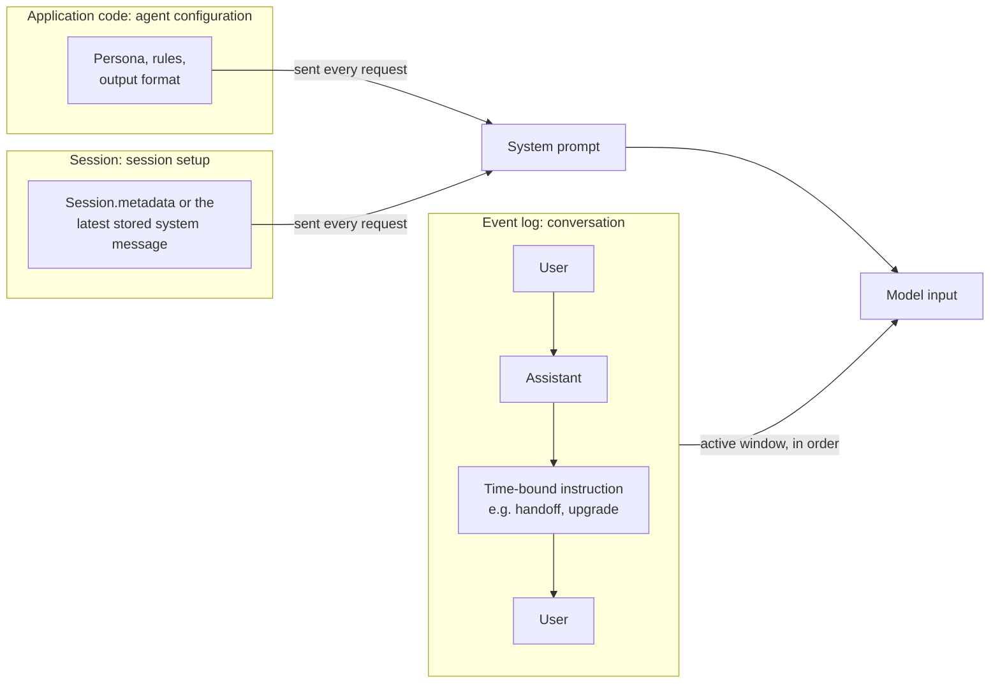
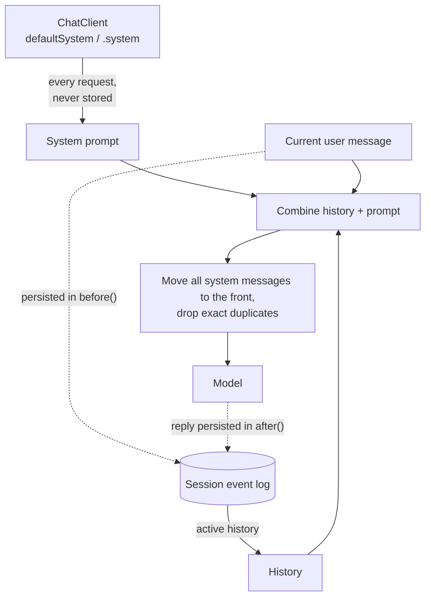

# System Messages

A system message tells the model *how to behave*: its persona, rules, output format.
This page explains why Spring AI Session treats system messages as **configuration**
rather than as part of the conversation, and which part of the work belongs to whom:

- **The session library** (`SessionService`, `SessionRepository` and the compaction
  strategies) stores and compacts events. It behaves the same for every integration.
- **Your integration** builds the prompt that is sent to the model. This is
  `SessionMemoryAdvisor` if you use `ChatClient`, or your own code if you use the session
  services from any other agent implementation.

**In short:**

- **Best practice: don't store system messages in the session.** Supply the system prompt
  on every request from your code, and keep per-session settings in `Session.metadata`.
  The session then holds only the conversation.
- **The library enforces this by default.** `DefaultSessionService` rejects a stored
  system message unless you enable `allowSystemMessages`. If you do enable it, **the latest
  stored system message wins**: it is the session's system prompt, and earlier ones are
  superseded and archived by compaction.
- **The integration** puts system messages first, drops exact duplicates, and avoids
  re-sending history inside a tool loop. `SessionMemoryAdvisor` does this for `ChatClient`.
  Any other integration must do it itself.

---

## Conversation or configuration?

A **conversation** is the record of an exchange between its participants: the user, the
assistant, and the tools the assistant calls. Each entry is something a participant said
or did at a point in time, and its position in the sequence matters. That record is what
Spring AI Session stores, filters, compacts and searches.

A system message is usually written by someone else: the developer who deploys the agent.
It describes how the assistant should behave, not what was said. Several things mark it as
configuration:

- **Different author.** No participant says it; it comes from code or a template.
- **Different lifecycle.** It is versioned and deployed with the application and applies
  to every session at once. Conversation entries belong to one session and never change.
- **No meaningful position.** "Always answer in French" means the same at turn 1 and at
  turn 50.
- **The model APIs treat it as a separate input.** Anthropic's `system` parameter, Gemini's
  `system_instruction` and OpenAI's `instructions` sit outside the message list.

Storing configuration as conversation causes well-known problems in memory frameworks:

- the prompt goes stale after the application changes it;
- it is duplicated when it is also sent per request;
- it is trimmed or summarized away;
- rewriting it inside the history breaks prompt caching.

Most conversation-memory frameworks therefore re-send the system prompt on each request
and keep it out of the stored history. Spring AI Session is designed for the same approach.

Not every instruction is configuration, though. Some happen *at a point in time*, and
their position does matter: "the user just upgraded to premium", "you are now handed off
to the billing agent", or context retrieved for this turn only. Those are conversation
events.

### Three kinds of instruction

| Kind | Example | What it is | Where it belongs |
|---|---|---|---|
| **Agent configuration** | persona, rules, output format | Configuration for every session | Supplied by your code on every request. Not stored |
| **Session setup** | language, tenant, per-session persona | Configuration for one session | `Session.metadata`, rendered into the system prompt per request. (Fallback: a stored system message, where the latest one wins) |
| **Time-bound instruction** | an upgrade, a handoff, per-turn context | A conversation event | Supplied with the request if it only matters for this turn. If the prompt itself must change, supply the new full prompt (or, as a fallback, store a new full system message) |



---

## What the session library does

These rules hold for every integration, because they are implemented by `SessionService`,
the repositories and the compaction strategies.

### It stores only what you append

The library never creates or injects a system message. The event log contains exactly
the messages your integration passes to `appendEvent` / `appendMessage`.

### Storing system messages is disabled by default

`DefaultSessionService` rejects any event that wraps a `SystemMessage` with an
`IllegalArgumentException`. The message explains how to supply the prompt per request
instead, and how to enable storing. This catches a common mistake in custom integrations:
appending the whole prompt, system prompt included, on every turn. That mistake duplicates
the system prompt in every request and grows the log.

`SessionMemoryAdvisor` never stores system messages, so the default does not affect the
`ChatClient` integration. Existing stored events can still be read, and compaction is not
affected. The rule is enforced by `DefaultSessionService`; a custom `SessionService`
implementation, or direct `SessionRepository` access, is not checked.

To store system messages anyway, see
[When storing a system message is acceptable](#when-storing-a-system-message-is-acceptable).

### It returns history in log order

`getActiveMessages(sessionId)` and `getEvents(sessionId, EventFilter.active())` return
the active window (archived events excluded) in the order the events were stored.
**System messages are not moved to the front and not deduplicated**; that is left to the
integration. `EventFilter.messageTypes(...)` can include or exclude `SYSTEM` events when
you load history.

### Compaction: the latest stored system message wins

If system messages are stored, the **latest** one is the session's system prompt. Storing
a new one replaces the previous one, so it must carry the complete intended content;
combining several instructions into it is the integration's responsibility. Every
[compaction strategy](compaction.md) handles stored system messages the same way:

- the latest one stays in the active window, is placed first, and is never archived or
  summarized;
- it doesn't use `maxEvents` / `maxTurns` / `maxEventsToKeep` slots, but
  `TokenCountCompactionStrategy` subtracts its tokens from the budget, because it is sent
  to the model;
- earlier ones are **superseded**: archived whenever compaction runs (even when the
  budget needs no cut), never summarized, and still searchable through
  [Recall Storage](recall-storage.md).

At most one stored system message per branch is ever active, so an integration that
stores one per turn cannot grow the active window.

**Sub-agents.** In a [multi-agent session](multi-agent.md), system messages are scoped by
branch: each agent's system prompt is the latest system message stored on **its own**
branch, and a sub-agent's system messages configure only that sub-agent. Compaction keeps
the latest one of every branch, so a sub-agent that is delegated to again in a later turn
still has its system prompt, even after the turn it was stored in has been archived. Like
every system message, they are never summarized.

---

## What your integration is responsible for

Whatever builds the prompt sent to the model owns these steps:

1. **Supply the system prompt on every request**, from code or rendered from
   `Session.metadata`. Don't append it to the session.
2. **Load only the active history**: `getActiveMessages(...)` or
   `getEvents(..., EventFilter.active())`.
3. **Use only the latest stored system message of your agent's own branch** (`null` for
   the root agent) from the loaded history. Earlier ones are superseded (they may still be
   active until the next compaction), and other branches' system messages configure other
   agents. Put system messages first: many models reject or ignore a system message that
   is not at the start.
4. **Drop exact duplicates**, for example a stored system message that is also supplied
   with the request. Don't merge or rewrite texts, so the prompt stays byte-stable for
   prompt caching.
5. **Persist only the conversation**: the user message, the model's reply, and tool
   calls and results.
6. **In a multi-round loop** (tool calling), don't add the stored history to a prompt that
   already carries it.
7. **Compact** after a turn when your trigger fires, with `SessionService.compact(...)`.

### With ChatClient: `SessionMemoryAdvisor`

`SessionMemoryAdvisor` implements all of these steps for `ChatClient`:

- the system prompt comes from `defaultSystem` / `.system` on every request, and the
  advisor never persists it;
- of the stored system messages it sends only the latest one on its own branch (the
  branch of its `EventFilter`, `null` for the root agent), moves every `SystemMessage` to
  the front (stored one first, then the request's), and sends an exact duplicate only
  once;
- when it runs once per tool-call round (see [Default advisor order](chat-client.md)), it
  leaves system messages out of its "already in the prompt" check, so stored history is not
  re-sent;
- it persists only the user (or tool-response) message and the model's reply, and runs
  compaction when configured.



```java
ChatClient chatClient = ChatClient.builder(chatModel)
    .defaultSystem("You are a helpful travel assistant. Answer concisely.")
    .defaultAdvisors(SessionMemoryAdvisor.builder(sessionService).build())
    .build();

// Session setup rendered from Session.metadata on each request
String answer = chatClient.prompt()
    .system(s -> s.text("Answer in {language}.")
        .param("language", session.metadata().get("language")))
    .user(question)
    .advisors(a -> a.param(ChatMemory.CONVERSATION_ID, session.id()))
    .call()
    .content();
```

### Without ChatClient: your own agent loop

An agent built on the session services directly (with its own loop, another framework, or
a server that fronts the model) must implement the steps itself. A minimal turn, here using
a Spring AI `ChatModel` as the model client:

```java
String sessionId = session.id();

// 1. Configuration: built by your code on every request, never stored
SystemMessage systemPrompt = new SystemMessage(
        "You are a helpful travel assistant. Answer in " + session.metadata().get("language") + ".");

// 2. Active history, in log order
List<Message> history = sessionService.getActiveMessages(sessionId);

// 3 + 4. Latest stored system message (if any) and the request's, first;
//        exact duplicates dropped
Optional<Message> storedPrompt = history.stream()
    .filter(SystemMessage.class::isInstance)
    .reduce((earlier, later) -> later);
Set<String> seen = new HashSet<>();
List<Message> input = new ArrayList<>();
Stream.concat(storedPrompt.stream(), Stream.of(systemPrompt))
    .filter(m -> seen.add(m.getText()))
    .forEach(input::add);
history.stream().filter(m -> !(m instanceof SystemMessage)).forEach(input::add);

UserMessage userMessage = new UserMessage(question);
input.add(userMessage);

AssistantMessage reply = chatModel.call(new Prompt(input)).getResult().getOutput();

// 5. Persist only the conversation
sessionService.appendMessage(sessionId, userMessage);
sessionService.appendMessage(sessionId, reply);

// 7. Compact when the trigger fires
sessionService.compact(sessionId, new TurnCountTrigger(20),
        TurnWindowCompactionStrategy.builder().maxTurns(10).build());
```

If your loop calls tools across several rounds, keep the in-flight messages in the loop,
and don't reload and prepend the stored history on every round (step 6).

---

## Best practice

**Keep system messages out of the session.** Configuration then always comes from code, a
change reaches every existing session on its next request, and there is nothing stored
that can go stale, get duplicated, or be compacted away. This holds for any integration:

- **Agent configuration:** build the system prompt in code on every request.
- **Session setup:** keep it in `Session.metadata` and render it into the system prompt
  on every request.
- **Time-bound instruction:** if it only matters for the current request, send it with
  that request and don't store it.

The examples above show both styles: the `ChatClient` one sets the system prompt with
`defaultSystem` / `.system`, and the custom loop builds it in code.

### When storing a system message is acceptable

Storing is supported for cases where the instruction can't come from code on each
request, for example when a session is created by one service and continued by another
that doesn't know its setup.

First, enable it, because it is disabled by default:

```java
SessionService sessionService = DefaultSessionService.builder()
    .sessionRepository(sessionRepository)
    .allowSystemMessages(true)
    .build();
```

or, with Spring Boot auto-configuration:

```yaml
spring:
  ai:
    session:
      allow-system-messages: true
```

Then store the session's system prompt. It stays active and protected from compaction
until you store a new one:

```java
Session session = sessionService.create(CreateSessionRequest.builder().userId("alice").build());
sessionService.appendMessage(session.id(), new SystemMessage("Answer in French."));
```

To change it later, store a new, **complete** system message. The latest one wins, and the
previous one is superseded and archived:

```java
sessionService.appendMessage(session.id(), new SystemMessage("Answer in German."));
```

Keep in mind the trade-offs:

- A stored system message doesn't change when your code changes. You have to store a new
  one to update it.
- Only the latest stored system message is used, so it must contain every instruction
  you want in effect. A new one replaces the previous one; it doesn't add to it.
- Its tokens are sent on every request and count toward `TokenCountCompactionStrategy`'s
  budget.
- Your integration still has to use only the latest one, put it first and drop duplicates.
  `SessionMemoryAdvisor` does this; a custom loop must do it itself (steps 3 and 4 above).

---

## See also

- [ChatClient Integration](chat-client.md): what `SessionMemoryAdvisor` does on each
  request
- [Context Compaction](compaction.md): strategies and turn-boundary safety
- [Session Concepts](concepts.md): sessions, events and the event log
